<!--
	Author:LEO
	WeChat:zw142857
	QQ:765508285
-->

# 移动APP第一天

## 环境配置

> 所有环境变量配置所在皆为 系统属性-高级-环境变量-系统变量 
> 快捷打开方式 `window + x -> 系统 -> 高级系统设置 -> 高级 -> 环境变量 -> 系统变量`

### Java环境配置

#### 安装Java JDK

> 下载Java JDK，网址：http://www.oracle.com/technetwork/cn/java/javase/downloads/jdk8-downloads-2133151-zhs.html 然后一路下一步就能够安装，安装完了就配置环境变量
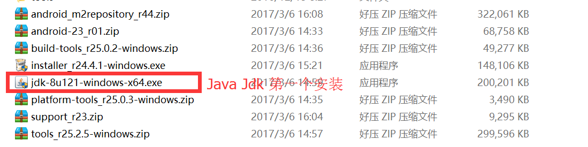


#### 配置Java环境变量

**1. 系统变量中添加配置 `JAVA_HOME`**
	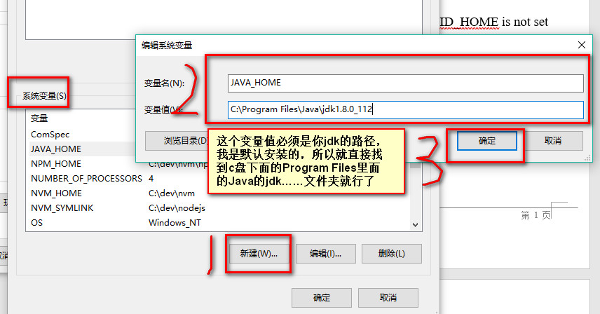


**2. Path环境变量中添加`%JAVA_HOME%\bin;%JAVA_HOME%\jre\bin;`**

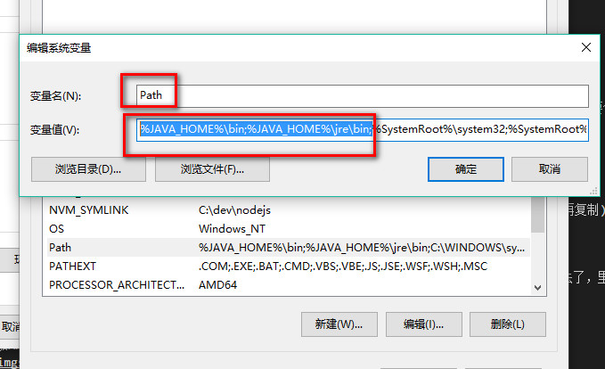

**3. 在CLASSPATH环境变量中添加`.;%JAVA_HOME%\lib\dt.jar;%JAVA_HOME%\lib\tools.jar;`,没有CLASSPATH就自己新建一个**

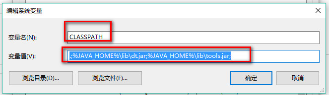

**4. 打开cmd命令行,执行`javac`,如下图显示,则说明Java环境已配置正确**

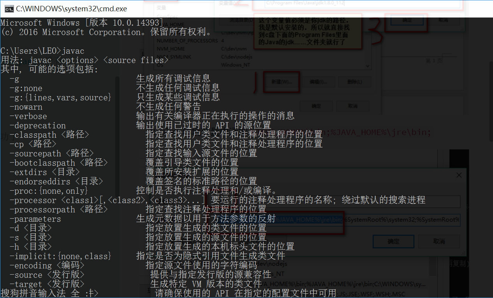

### Android环境配置

> 下载Android SDK,下载地址 http://www.androiddevtools.cn/
> 下载Android 环境依赖包：http://mirrors.neusoft.edu.cn/android/repository/

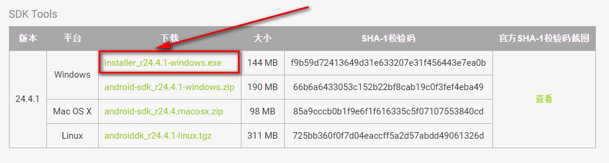

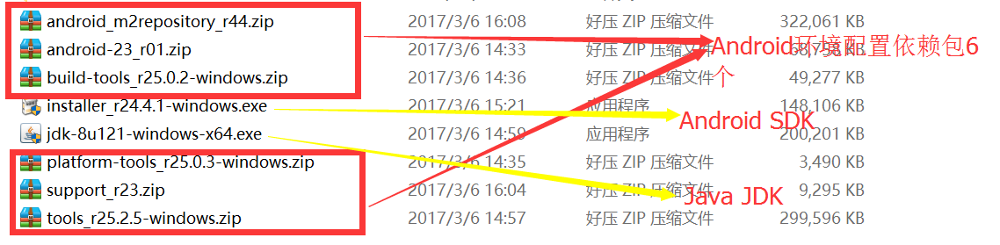

#### 安装 Android SDK 和 依赖包

**1. 安装Android SDK,可以采用默认安装，安装过程中会让选择是配置到所用用户还是当前用户，选择所有用户。默认安装路径应该是`C:\Program Files (x86)\Android\android-sdk`**

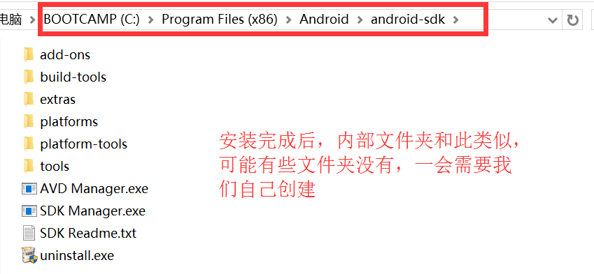

> 提示: 如果网好的话，可以直接用SDK Manager来安装剩下的所有工具包，后面所有步骤就不需要做了。没网就需要用到下面的离线包按步骤自行安装

**2. 安装`build-tools`,参照下图**

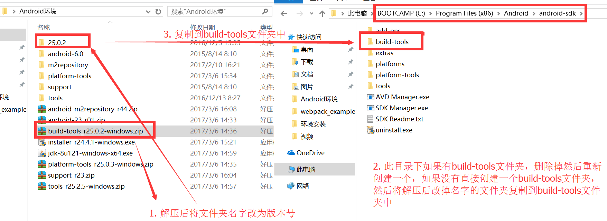


**3. 安装`platform-tools`,直接解压复制到SDK Manager目录(如果下面已经存在platform-tools，就先把它删掉再复制)**

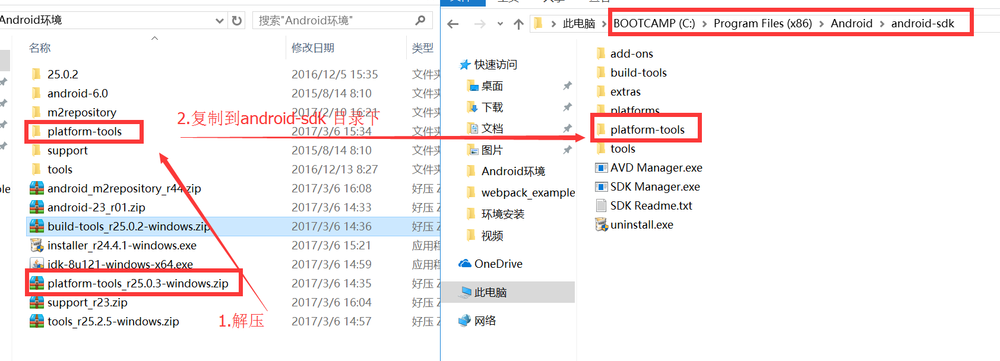

**4. 安装`platforms`,参照下图**

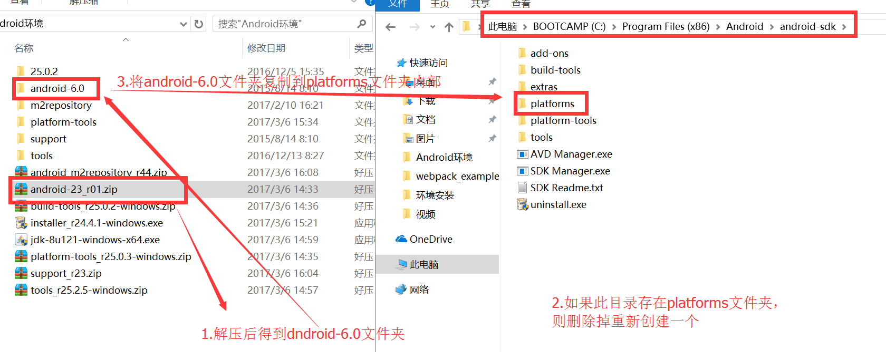

**5. 安装`tools`，解压`tools_r25.2.5`压缩包,直接复制到SDK Manager目录(如果存在tools文件夹,就先删除在复制)**

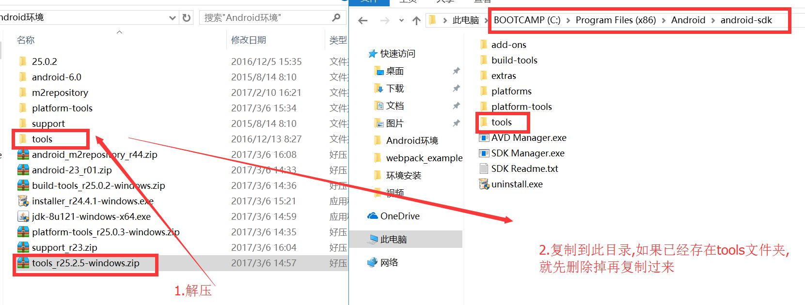

**6.新建`extras/android`文件夹，将m2repository和support解压后的两个文件夹放进android文件夹下面**

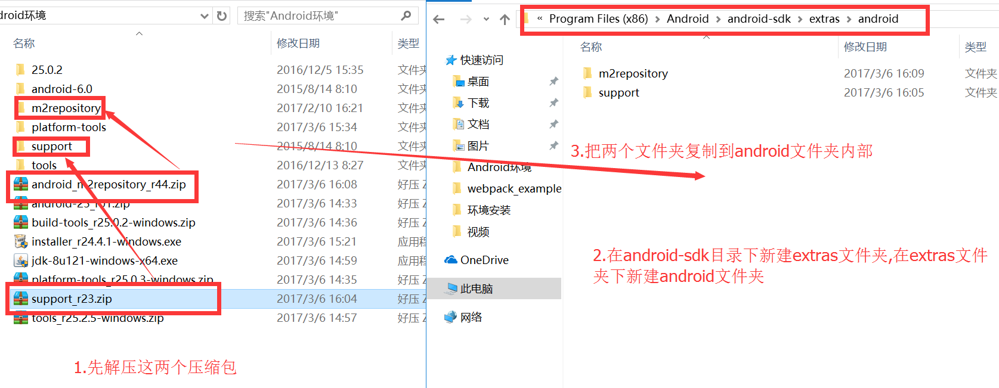

#### 配置Android环境变量

**1. 系统变量中添加配置 `ANDROID_HOME`**

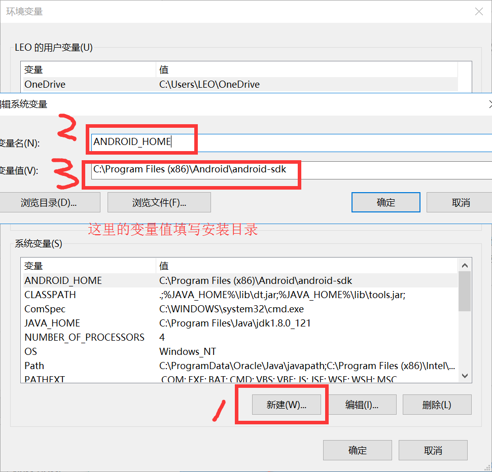

**2. Path中添加Android的环境变量`%ANDROID_HOME%\tools;%ANDROID_HOME%\platform-tools`**

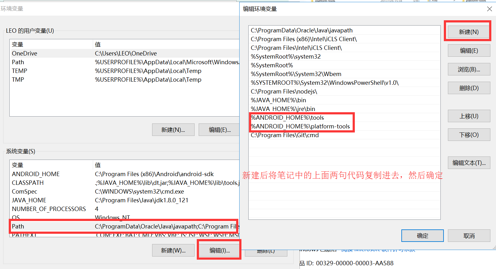

**3. 配置完毕后，在cmd命令行窗口中输入`adb`,见到如下提示，说明Android环境已经安装成功**

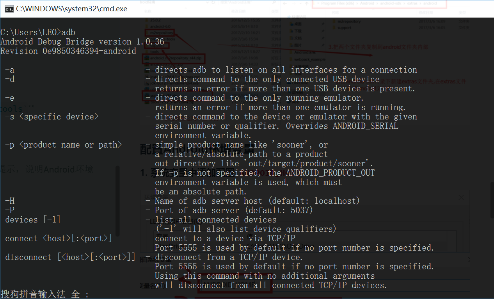


## 混合APP开发
### 安装项目依赖环境

	// 1. 全局安装打包工具 cordova
	npm install cordova -g
	
	// 2. 全局安装框架ionic
	npm install ionic -g


### 创建项目


	// 使用ionic创建项目模板
	// ionic start ionic_example

	cordova create cordova_example


### 打包APP

	// 1. 添加项目平台(android)
	// ionic platform add android

	cordova platform add android
	
	// 2. 打包
	cordova build android

	// 3. 运行在手机
	// ionic run android

	cordova run android

## Webpack使用

### webpack项目结构

1. 在代码文件夹中创建项目文件夹 `webpack_example`,在项目文件夹中按照下图所示创建项目结构，其中`node_modules`和`package.json`不用手动创建

	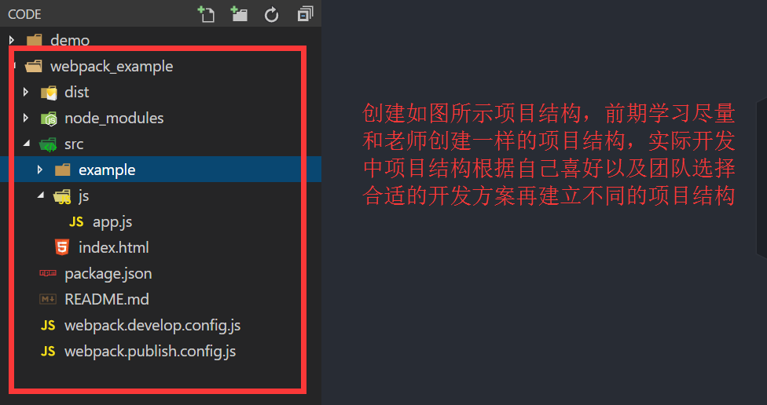


2. 创建`package.json`文件


		// 在webpack_example文件夹下 打开命令行窗口 使用如下命令
		npm init -y

3. 全局安装`webpack`

		npm install webpack -g

4. 局部安装webpack及依赖

		// 在webpack_example文件夹下 打开命令行窗口 使用以下命令局部安装 webpack
		npm install webpack --save-dev

### webpack配置文件

#### 基本配置

> 注意: `webpack`默认配置文件名是`webpack.config.js`
> 
> 在项目根目录下直接使用`webpack`命令会寻找`webpack.config.js`执行
>
> 因为我们的配置文件名称为`webpack.develop.config.js`,所以执行时需要使用
> `webpack --config webpack.develop.config.js`

1. 打开`webpack.develop.config.js`文件,配置以下内容


		/**
		 *  webpack 开发阶段配置文件
		 */
		
		var path = require('path');
		module.exports = {
		    // 入口文件
		    entry: path.resolve(__dirname, 'src/js/app.js'),
		    // 输出文件
		    output: {
		        // 输出至哪个文件夹
		        path: path.resolve(__dirname, 'dist'),
		        // 输出的文件名
		        filename: 'bundle.js'
		    }
		}
 

2. 在`app.js`文件中输入代码,使用`webpack`命令运行，可以看到一个`bundle.js`文件被生成(项目文件夹下的`dist`目录下会有一个`bundle.js`文件)


		// 1. 在app.js文件中输入 
		var a = 10;
		
		// 2. 在当前项目根目录打开命令行，使用以下webpack命令
		webpack --config webpack.develop.config.js


	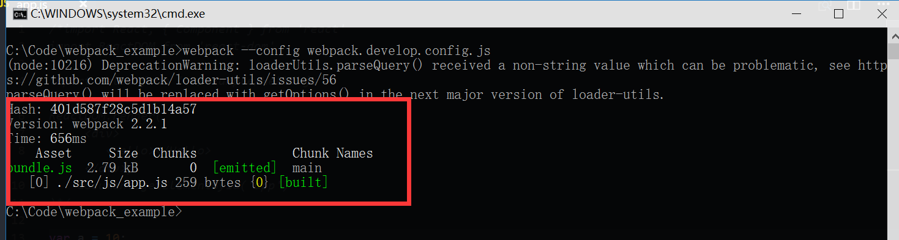

#### 配置文件改造

>  每次运行代码需要执行很长的命令比较麻烦,我们可以使用npm run命令来快捷执行

##### 快捷执行

1. 在package.json文件加入以下内容


		"scripts": {
		    "test": "echo \"Error: no test specified\" && exit 1",
		    "develop": "webpack --config webpack.develop.config.js",
		    "publish": "webpack --config webpack.publish.config.js"
		  },


2. 以后再运行代码就可以直接使用`npm run develop`，效果和最开始直接执行`webpack --config webpack.develop.config.js`是一样的

	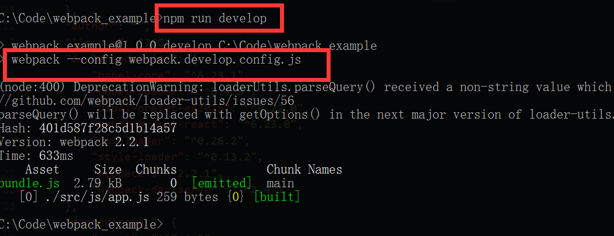

### 自动更新

> 如果希望代码一改动，不需要重新运行`npm run develop`就可以自动构建，并且浏览器显示的内容也能自动刷新,需要安装`webpack-dev-server`并重新配置`package.json`文件

1. 全局安装`webpack-dev-server`


		npm install webpack-dev-server -g

2. 局部安装`webpack-dev-server`及其依赖

		npm install webpack-dev-server --save-dev

3. 在`package.json`文件中的`develop`下做如下更改

		"scripts": {
		
		        "develop": "webpack-dev-server --config webpack.develop.config.js --devtool eval-source-map --progress --colors --inline --hot --content-base ./dist",
		        
		    }

4. 然后重新执行 `npm run develop`命令，访问`http://localhost:8080`

5. 此时直接修改`app.js`中的内容,可以看到命令行窗口会自动构建，而且浏览器中的内容会自动刷新

> 注意: 如果有修改过`package.json`文件，必须手动执行一次`npm run develop`命令构建项目

## webpack加载器配置

> `loader`：`webpack`提供的一批预处理工具，可以将浏览器不识别的代码处理成可识别可以执行的代码

### babel-loader

> `babel-loader`可以将`ES6`语法转换成`ES5`语法，将`React`语法转成普通`JavaScript`语法

1. 在当前项目目录下安装`babel-loader`


		npm install babel-loader --save-dev

2. 安装依赖模块

		npm install babel-core babel-preset-es2015 babel-preset-react --save-dev

3. 修改`webpack.develop.config.js`

		// 在module.exports对象下增加如下内容
		module: {
		        // webpack 1 写法
		        // loaders: [{
		        //     test: /\.jsx?$/, //用正则匹配文件路径,匹配jsx和js
		        //     loader: 'babel-loader',
		        //     query: {
		        //         presets: ['es2015', 'react']
		        //     }
		        // }]
		
		        // webpack 2 写法
		        rules: [{
		                test: /\.jsx?$/,
		                use: [{
		                    loader: 'babel-loader',
		                    options: {
		                        presets: ['es2015', 'react']
		                    }
		                }]
		            }]
		    }

4. 配置完毕后，可以下载`React`和`React-DOM`书写`React`代码验证是否可以转换

		npm install react react-dom -save

5. 在`app.js`文件中书写`React`代码

			 /**
			 * 项目入口文件
			 */
			 // 引入React
			import React, { Component } from 'react'
			// 引入ReactDOM
			import ReactDOM from 'react-dom'
			
			// 使用ReactDOM渲染html节点
			ReactDOM.render(
			     <div>
			        hello world
			     </div>,
			    document.getElementById('app')
			)
			// 在JavaScript文件中书写HTML代码，叫做jsx语法，所以React文件一般用jsx作为后缀名

6. 由于此时是`jsx`语法,浏览器不识别,所以如果没有`babel-loader`直接编译，会报错

	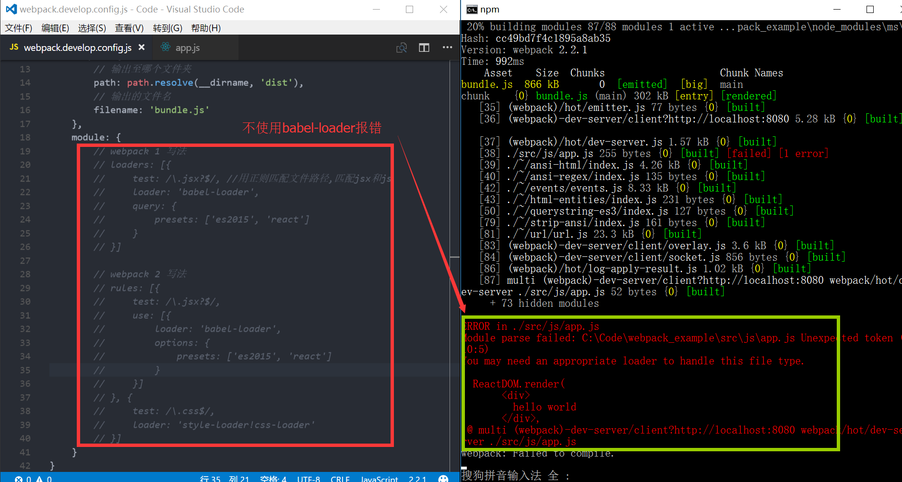

7. 使用`babel-loader`后,编译

	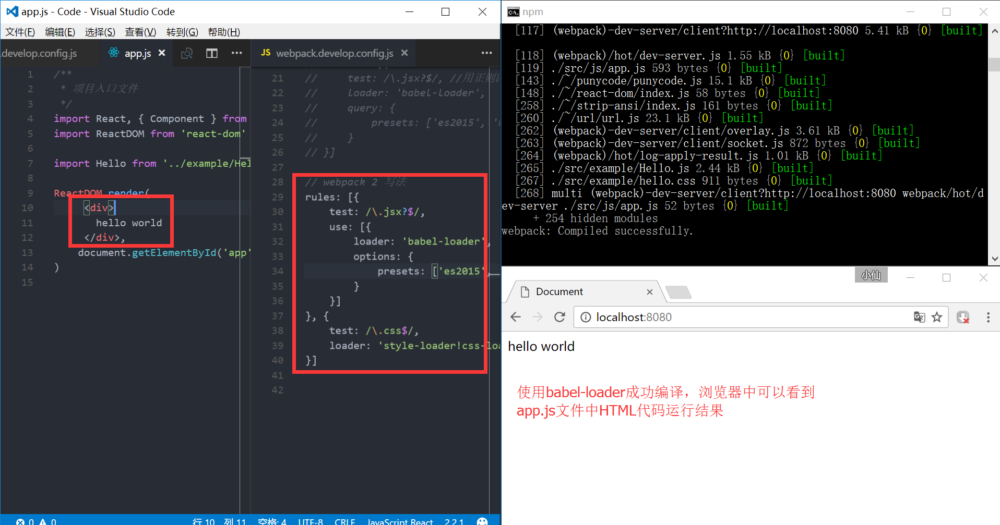


### css-loader&style-loader

> `css-loader`以及`style-loader`用来处理`CSS`，`css-loader`会遍历`css`文件，找到所有的`url(...)`并且处理。`style-loader`会把所有的样式插入到你页面的一个`style tag`中

1. 安装`css-loader`和`style-loader`

	npm install css-loader style-loader --save-dev

2. 修改配置文件,添加`css-loader`和`style-loader`

		rules: [{
		            test: /\.jsx?$/,
		            use: [{
		                loader: 'babel-loader',
		                options: {
		                    presets: ['es2015', 'react']
		                }
		            }]
		        }, {
		            test: /\.css$/,
		            // 注意:必须先写style-loader再写css-loader
		            loader: 'style-loader!css-loader'
		            // 下面这张写法也可以
		            // use: ['style-loader', 'css-loader']
		        }]

3. 用`React`自定义一个组件，新建一个文件`Hello.js`

		import React, { Component } from 'react'
		import './hello.css'
		
		export default class Hello extends Component {
		    render() {
		        return (
		             <div >
		                <h1>hello world!</h1>
		             </div>
		        )
		    }
		}

4. 新建一个`hello.css`文件，并在`Hello.js`中引入这个`css`文件

		h1 {
		    color: red;
		}

5. 在`app.js`中使用这个`Hello`组件
		
		/**
		 * 项目入口文件
		 */
		import React, { Component } from 'react'
		import ReactDOM from 'react-dom'
		
		import Hello from '../example/Hello.js'
		
		ReactDOM.render(
		     <div>
		       <Hello />
		     </div>,
		    document.getElementById('app')
		)

5.  使用`npm run develop`编译查看运行结果

	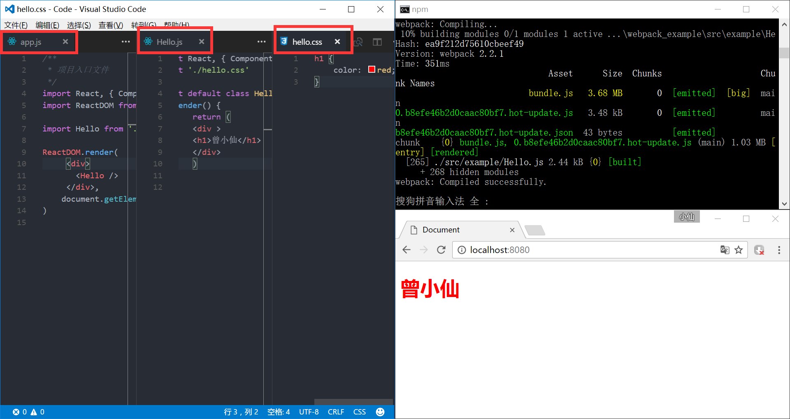


### scss-loader

> `scss-loader`将`SASS`和`LESS`转换成正常可识别`CSS`

1. 安装`sass-loader`及其依赖

		npm install node-sass
		npm install sass-loader --save-dev

2. 修改配置文件,添加`sass-loader`

		rules: [
		            // 转换ES6语法和React jsx语法
		            {
		                test: /\.jsx?$/,
		                use: [{
		                    loader: 'babel-loader',
		                    options: {
		                        presets: ['es2015', 'react']
		                    }
		                }]
		            },
		            // 处理js中引用css文件
		            {
		                test: /\.css$/,
		                // loader: 'style-loader!css-loader'
		                use: ['style-loader', 'css-loader']
		            },
		            // 处理js中引用sass文件
		            {
		                test: /\.scss$/,
		                use: ['style-loader', 'css-loader', 'sass-loader']
		            }
		        ]

3. 新建`_base.scss`和`hello.scss`文件

	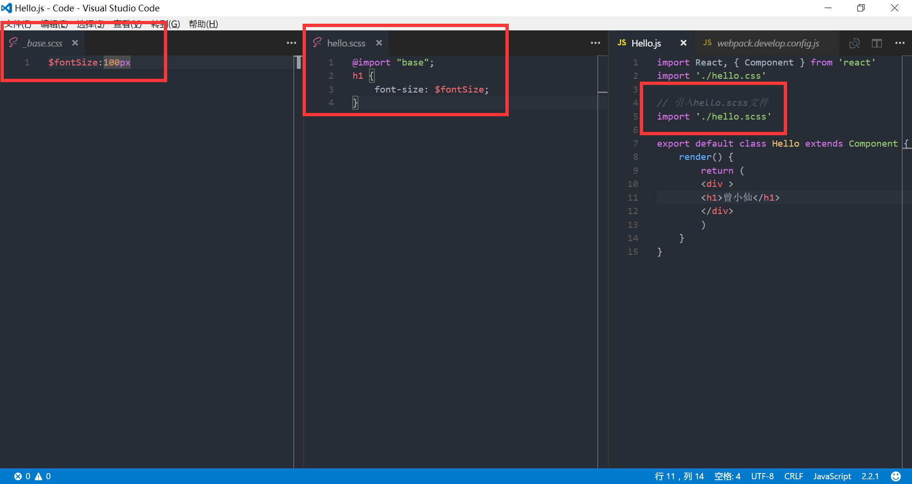

4. 重新使用`npm run develop`构建项目

	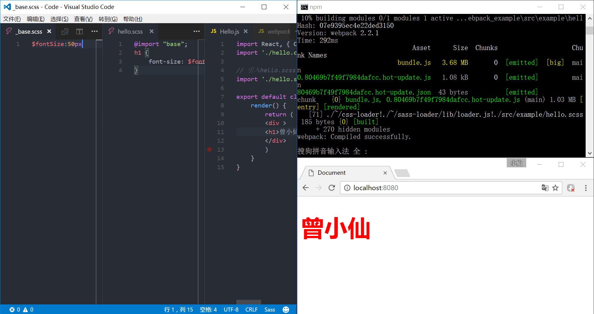


### url-loader

>  `url-loader`用来打包文件和图片以及处理`icon`字体的加载器

1. 安装`url-loader`和`file-loader`

		npm install url-loader file-loader -save-dev

2. 修改配置文件，在`rules`下面添加


		// 处理图片操作
		{
			test: /\.(png|jpg|jpeg|gif)$/,
			use: 'url-loader?limit=25000'
		}


3. 创建`images`文件夹引入一张图片，在`Hello.js`组件中添加`image`标签，然后在`hello.css`文件中设置图片地址及其他样式

	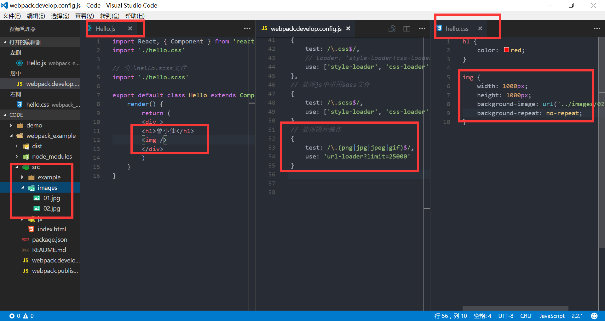

4. 重新使用`npm run develop`构建项目

	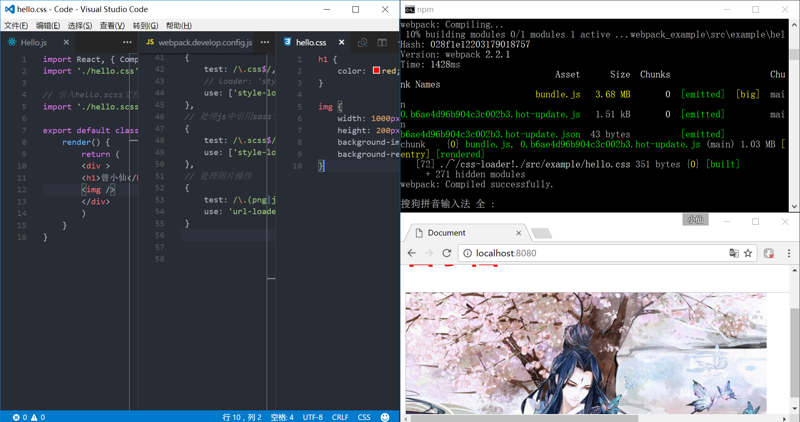


>  `ulr-loader`配置信息的参数“?limit=8192”表示将所有小于8kb的图片都转为base64形式 （其实应该说超过8kb的才使用 url-loader 来映射到文件，否则转为data url形式）。这样做的好处是较小的图片不用去发送网络请求。


> `url-loader`也可以用来处理`icon`字体，配置信息为:

	// 处理iconfont
	{
	 	test: /\.(eot|woff|ttf|woff2|svg)$/,
	 	use: 'url-loader?limit=2500'
	}

# 移动APP第二天

## webpack发布策略

### 修改配置文件

1. 将`webpack.develop.config.js`中的内容拷贝到`webpack.publish.config.js`中,然后进行修改,如下:

	


2. 执行`npm run publish` 可以看到`dist`目录下生成了`bundle.js`和对应的`images`文件夹和图片
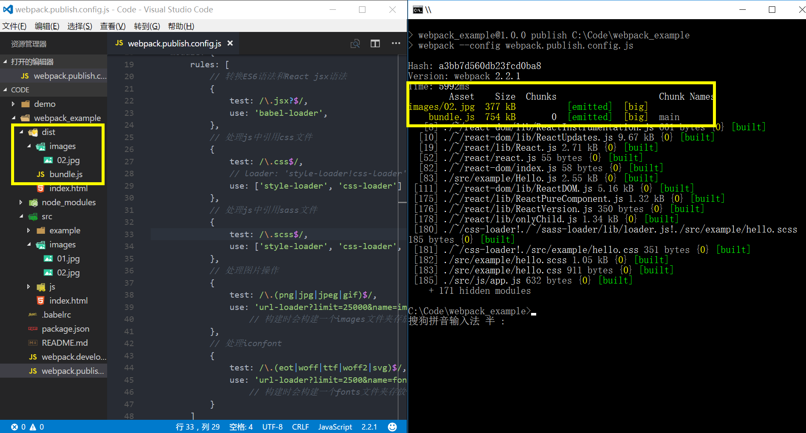


### 分离第三方包

1. 在`webpack.publish.config.js`中做如下修改

	-  修改入口文件

			 // 分离第三方包后的入口文件
			    entry:{
			        app:path.resolve(__dirname, 'src/js/app.js'),
			        // 需要分离的第三方包名写在数组中
			        vendors:['react','react-dom']
			    },

	- 增加插件

			 plugins:[
			        // 分离第三方包插件
			        new webpack.optimize.CommonsChunkPlugin({name:'vendors',filename:'vendors.js'})
			    ]

2. 在`index.js`文件中引用`vendors.js`文件,然后执行编译

	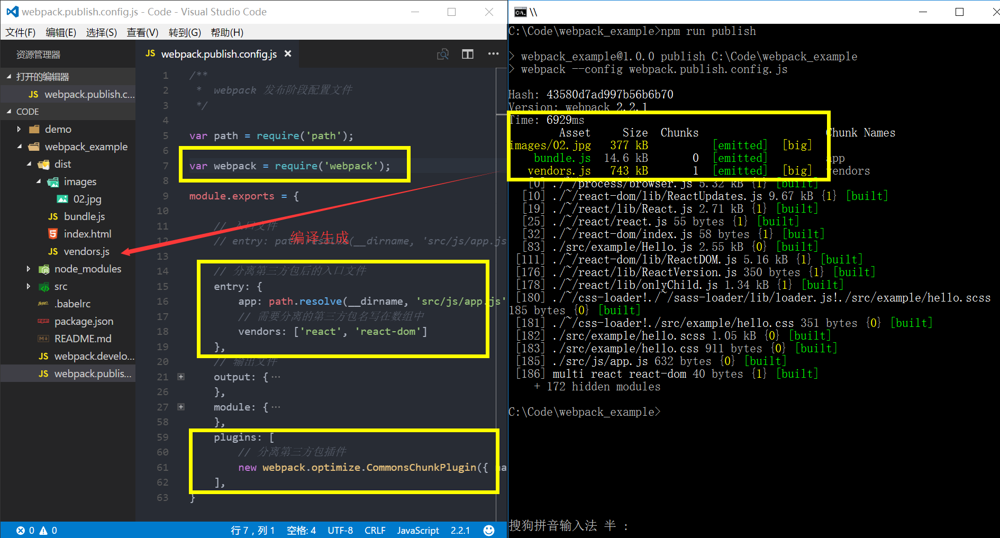


## webpack常用插件

### 删除文件夹插件

> `clean-webpack-plugin`:在每次重新构建项目时，会自动删除上一次构建产生的文件夹和文件，防止产生冲突

1. 安装插件

		npm install clean-webpack-plugin -save-dev

2. 使用插件，在`webpack.publish.config.js`中做修改

	- 引入插件: `var CleanPlugin = require('clean-webpack-plugin');`
	- 配置插件:`new CleanPlugin(['dist'])`

		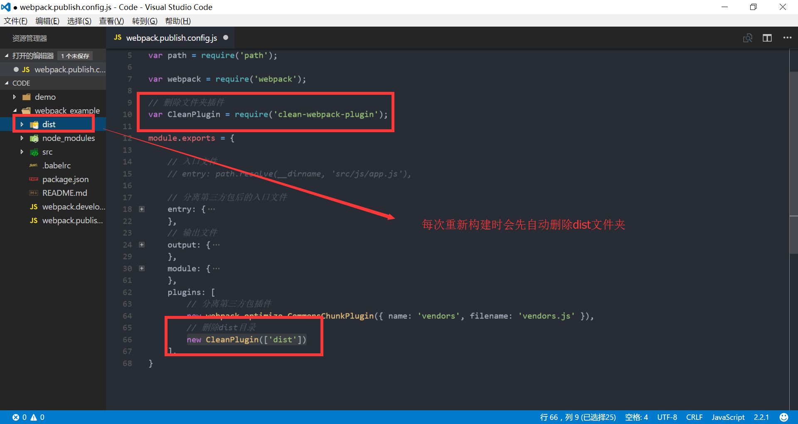

3. `npm run publish` 重新构建项目

	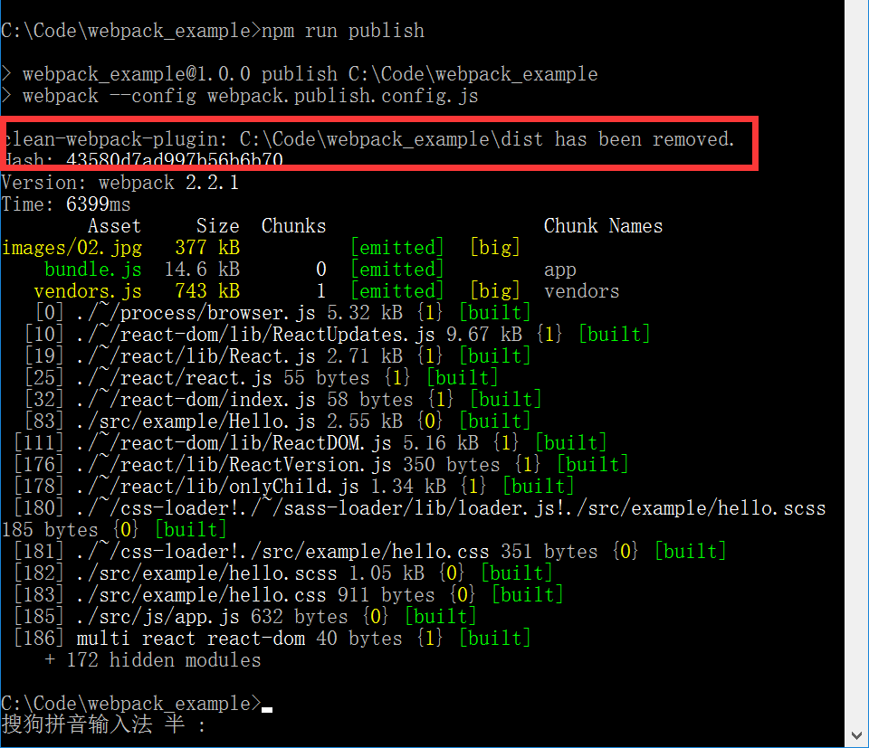

### 自动生成HTML页面插件

> `html-webpack-plugin`根据配置信息自动生成一个HTML页面,配置信息中主要填写引用的css和js文件

1. 安装插件

		npm install html-webpack-plugin -save-dev

2. 使用插件

	- 引入插件
	
			// 自动生成HTML页面
			var HtmlWebpackPlugin = require('html-webpack-plugin');
	
	- 配置插件

			 new HtmlWebpackPlugin({
	            // 需要复制的HTML页面模板(在src目录下创建template.html)
	            template: './src/template.html',
	            htmlWebpackPlugin: {
	                "files": {
		                // 需要引入的css文件
	                    "css": ["app.css"],
	                    // 需要引入的js文件
	                    "js": ["vendors.js", "bundle.js"]
	                }
	            },
	            // 代码压缩
	            minify: {
	                // 删除注释
	                removeComments: true,
	                // 删除空格
	                collapseWhitespace: true,
	                // 删除空格缩进
	                removeAttributeQuotes: true
	            }
			})

3. 重新构建项目

	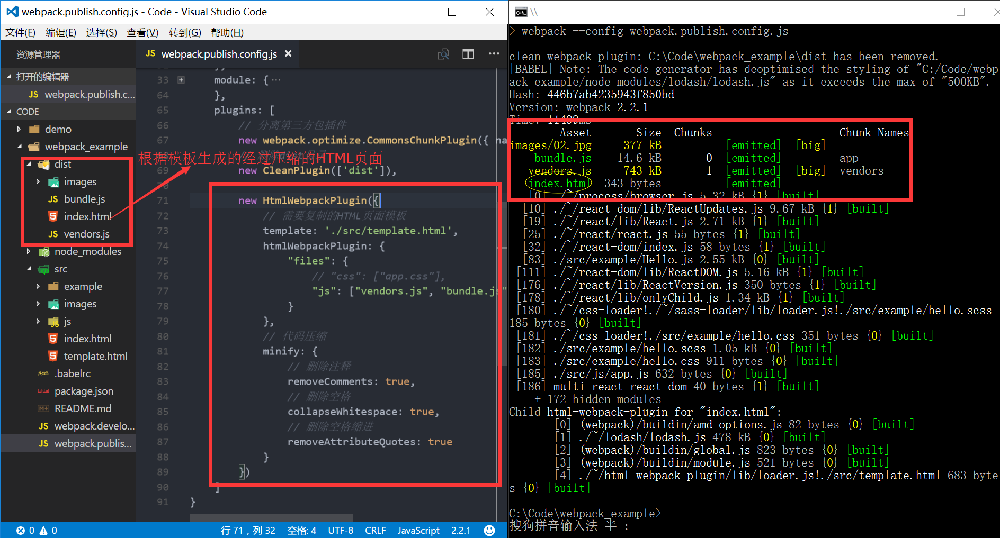


### 代码压缩混淆插件

> `webpack.optimize.UglifyJsPlugin` 是webpack内置插件,用来压缩js代码

1. 直接在`plugins`中配置插件

		// 代码压缩插件
		new webpack.optimize.UglifyJsPlugin({
		    compress: {
		        warnings: false
		    }
		})

2. 重新构建项目对比压缩前和压缩后代码大小区别

	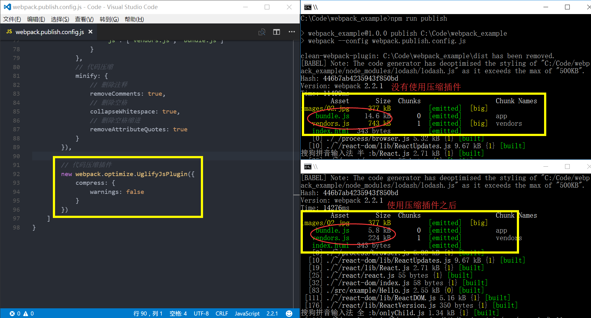

### 抽取css文件插件

> `webpack`编译打包的`CSS`代码正常情况下会以`style`样式内嵌在目标`html`文件里面，但是如果用了`extract-text-webpack-plugin` 这个插件之后会先编译并打包所有的`CSS`代码

1. 安装插件

		npm install extract-text-webpack-plugin -save-dev

2. 使用插件

	- 引入插件
	
	
			// 抽取css文件插件
			var ExtractTextPlugin = require('extract-text-webpack-plugin');
	
	- 修改配置文件
	
	
			// 处理js中引用css文件
			{
			    test: /\.css$/,
			    // loader: 'style-loader!css-loader'
			    // use: ['style-loader', 'css-loader']
			    // 使用抽取css插件后加载器写法
			    use: ExtractTextPlugin.extract({
				    fallback: "style-loader",
				    use: "css-loader"
				})
			}
	
	
			// 抽取css文件插件
			new ExtractTextPlugin('app.css')


3. 重新构建项目，会多生成一个`app.css`文件

	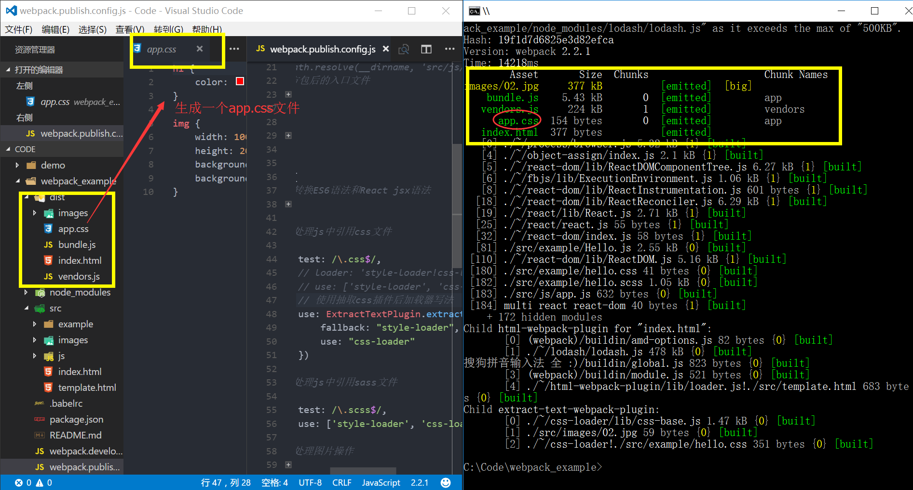

>  `extract-text-webpack-plugin`插件也可以抽取`sass`，只需要修改一下配置文件

		// 处理js中引用sass文件
		{
		    test: /\.scss$/,
		    // use: ['style-loader', 'css-loader', 'sass-loader']
		    // 使用抽取sass写法
		    use: ExtractTextPlugin.extract({
		        fallback: "style-loader",
		        use: "css-loader!sass-loader"
		    })
		}

### 压缩代码插件(删除警告)

1. 在配置文件中添加如下代码:

		// 删除警告
		new webpack.DefinePlugin({
		    'process.env': {
		        NODE_ENV: '"production"'
		    }
		})

### 自动打开浏览器插件

> `open-browser-webpack-plugin`在开发阶段使用，构建完毕自动打开浏览器

1. 安装插件

		npm install open-browser-webpack-plugin -save-dev

2. 使用插件: 在`webpack.develop.config.js`中添加

	- 引入插件
	
			// 自动打开浏览器插件
			var OpenBrowserPlugin = require('open-browser-webpack-plugin');
			
	- 配置插件
	
			plugins: [
			    new OpenBrowserPlugin({
			        url: 'http://localhost:8080',
			        browser: 'chrome'
			    })
			]

3. 使用`npm run develop`构建项目可以自动打开浏览器

## React

### React简介

> `React` 是一个用于构建用户界面的 `JavaScript` 库。
`React`主要用于构建`UI`，很多人认为 `React` 是 `MVC` 中的 `V`（视图）。
`React` 起源于 `Facebook` 的内部项目，用来架设 `Instagram` 的网站，并于 2013 年 5 月开源。

### React四个核心概念

#### Virtual DOM 虚拟DOM

> 组件并不是真实的 `DOM` 节点，而是存在于内存之中的一种数据结构，叫做虚拟 `DOM` `(Virtual DOM)`。只有当它插入文档以后，才会变成真实的 `DOM` 。根据 `React` 的设计，所有的 `DOM` 变动，都先在虚拟 `DOM` 上发生，然后再将实际发生变动的部分，反映在真实 `DOM`上，这种算法叫做 `DOM diff` ，它可以极大提高网页的性能表现。

#### 组件化

> `React` 允许将代码封装成组件`(component)`，然后像插入普通 `HTML` 标签一样，在网页中插入这个组件。`React.createClass` 方法就用于生成一个组件类

		// 创建组件
		var HelloMessage = React.createClass({
		  render: function() {
		    return <h1>Hello {this.props.name}</h1>;
		  }
		});
		
		// 使用组件
		ReactDOM.render(
		  <HelloMessage name="John" />,
		  document.getElementById('example')
		);

#### JSX语法

> HTML 语言直接写在 JavaScript 语言之中，不加任何引号，这就是 JSX 的语法，它允许 HTML 与 JavaScript 的混写。

> JSX 的基本语法规则：遇到 HTML 标签（以 < 开头），就用 HTML 规则解析；遇到代码块（以 { 开头），就用 JavaScript 规则解析。

		var names = ['赵日天', '叶良辰', '龙傲天'];
		ReactDOM.render(
		  <div>
		  {
		    names.map(function (name) {
		      return <div>Hello, {name}!</div>
		    })
		  }
		  </div>,
		  document.getElementById('example')
		);

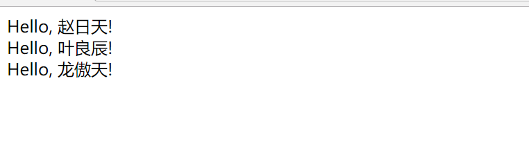

#### DataFlow 单向数据流

> react中，应用的数据传递是单向的通过state和props对象，不同于angular的双向数据绑定。单向数据流的意思就是，在一个多组件构成的应用中，每一个父组件负责管理state并且通过props传递给下一层组件。

> 状态（state）通过setState方法来更新，来确保UI更新发生。如果有必要state的最终结果值应该被当作 子组件的属性 传递给子组件，在子组件中通过this.props来获取值。


### 组件生命周期

> 组件的生命周期可分成三个状态:
> **`Mounting`**：已插入真实 DOM
> **`Updating`**：正在被重新渲染
> **`Unmounting`**：已移出真实 DOM

#### 生命周期函数

- **`componentWillMount` 在渲染前调用,在客户端也在服务端。**
- **`componentDidMount` : 在第一次渲染后调用，只在客户端。之后组件已经生成 了对应的DOM结构，可以通过this.getDOMNode()来进行访问。 如果你想和其他JavaScript框架一起使用，可以在这个方法中调用setTimeout, setInterval或者发送AJAX请求等操作(防止异部操作阻塞UI)。**
- **`componentWillReceiveProps` 在组件接收到一个新的prop时被调用。这个方法在初始化render时不会被调用。**
- **`shouldComponentUpdate` 返回一个布尔值。在组件接收到新的props或者state时被调用。在初始化时或者使用forceUpdate时不被调用。可以在你确认不需要更新组件时使用。**
- **`componentWillUpdate`在组件接收到新的props或者state但还没有render时被调用。在初始化时不会被调用。**
- **`componentDidUpdate` 在组件完成更新后立即调用。在初始化时不会被调用。**
- **`componentWillUnmount`在组件从 DOM 中移除的时候立刻被调用。**

#### ES5组件生命周期函数写法

	// ES5定义组件的写法
	import React, {Component} from 'react';
	// 创建组件
	var Life = React.createClass({
	   // getDefaultProps,getInitialState在es6的写法中不被支持
	   // 初始化props属性方法
	   getDefaultProps(){
	       console.log("getDefaultProps - 初始化props属性");
	   },
	   // 初始化我们的state属性
	   getInitialState(){
	       console.log("getInitialState - 初始化state的值");
	       return {
	           props1:"初始化state的值"
	       }
	   },
	   // 组件将要被渲染到真实的dom节点中
	   componentWillMount(){
	        console.log("componentWillMount - 组件将要被渲染到真实的dom节点");
	    },
	   // 组件已经插入到真实的dom节点中
	   componentDidMount(){
	       console.log("componentDidMount - 组件已经插入到真实的dom节点");
	   },
	   // 组件是否要被重新渲染
	   shouldComponentUpdate(){
	       // 这个方法比较特殊，如果你要重写，你要在这里手动的进行一下state值是否发生改变的判断，因为已经把之前的方法覆盖了
	       console.log("shouldCompontentUpdate - 判断组件是否要被重新渲染");
	       return true;
	   },
	   // 组件将要被重新渲染
	   componentWillUpdate(){
	       console.log("componentWillUpdate - 组件将要被重新渲染");
	   },
	   // 组件已经被重新渲染
	   componentDidUpdate(){
	       console.log("componentDidUpdate - 组件已经被重新渲染");
	   },
	   // 组件将要接受到新属性
	   componentWillReceiveProps(){
	       console.log("componnentWillReceiveProps - 组件将要接受到新属性");
	   },
	   click1(){
	       console.log("点击事件");
	       this.setState({
	           props1:"改变state的值"
	       })
	       console.log("2");
	       console.log(this.state.props1);
	   },
	   render() {
	       console.log("render");
	       return (
	           <div>
	               <h1 onClick={this.click1}>{this.state.props1}</h1>
	           </div>
	       )
	   }
	})
	
	module.exports=Life;
		
#### ES6组件生命周期函数写法

	// ES6语法定义的组件生命周期
	import React, {Component} from 'react';
	
	// 创建并导出组件
	export default class Life extends Component {
	    constructor(props){
	        super(props)
	        console.log("构造函数")
	        // 初始化了我们的state，这是被推荐的写法
	        this.state = {
	            props1:"初始化state"
	        }
	    }
	
	    static defaultProps = {
	        autoPlay: false,
	        maxLoops: 10,
	    }
	
	    // 组件将要被渲染到真实的dom节点中
	    componentWillMount(){
	        console.log("componentWillMount - 组件将要被渲染到真实的dom");
	    }
	    // 组件已经插入到真实的dom节点中
	    componentDidMount(){
	        console.log("componentDidMount - 组件已经插入到真实的dom");
	    }
	    // 组件是否要被重新渲染
	    shouldComponentUpdate(){
	        console.log("shouldCompontentUpdate - 判断组件是否要被重新渲染");
	        return true;
	    }
	    // 组件将要被重新渲染
	    componentWillUpdate(){
	        console.log("conpontentWillUpdate - 组件将要被重新渲染");
	    }
	    // 组件已经被重新渲染
	    componentDidUpdate(){
	        console.log("conpontentDidUpdate - 组件已经被重新渲染");
	    }
	    // 组件将要接受到新属性
	    componentWillReceiveProps(){
	        console.log("compintentWillReceiveProps - 组件将要接受到新属性");
	    }
	    click1 = ()=>{
	        console.log("点击了单击事件");
	        this.setState({
	            props1:"改变state的值"
	        })
	        console.log("点击了单击事件结束");
	    }
	    render() {
	        console.log("render");
	        return (
	            <div>
	                <h1 onClick={this.click1}>{this.state.props1}</h1>
	            </div>
	        )
	    }
	}

### ES6定义组件语法及注意事项

####  语法规定

> 定义模块 

	class Life extends Component

> 导出模块

	export default

> 引入模块 

	import Life from '../example/Life.js'
	
> 默认属性

	static defaultProps = {
		 autoPlay: false,
		 maxLoops: 10,
	};

> 默认state

	// 构造函数
	constructor(props){
	    super(props)
	    // 初始化state
	    this.state = {
	        props1:"初始化state"
	    }
	}

> 定义方法

- 生命周期方法直接方法名小括号

		componentWillMount(){
		    console.log("componentWillMount - 组件将要被渲染到真实的dom");
		}

- 自定义方法使用箭头函数

		click1 = ()=>{
		    console.log("点击了单击事件");
		    this.setState({
		        props1:"改变state的值"
		    })
		    console.log("点击了单击事件结束");
		}

#### 注意事项

> 箭头函数转ES5需要额外安装插件

	npm install --save-dev babel-preset-stage-0
	npm install --save-dev babel-plugin-transform-class-properties
	
> 下面两种事件函数，一种直接函数名小括号，一种是箭头函数
> 在给具体元素绑定函数时，箭头函数依旧需要使用一个箭头函数来绑定
> 函数名小括号形式在绑定时需要绑定this

	// 单击事件处理方法
	handleClick(pm1,pm2,pm3,e) {
	    console.log(pm1); // 23
	    console.log(pm2); // dfdf
	    console.log(pm3); // function
	    console.log(e); // event
	    this.setState({ liked: !this.state.liked });
	}
	
	// 用箭头函数去定义自己的方法
	handleMouseOver=(str)=>{
	    console.log(str);
	}
	
	render() {
	    const text = this.state.liked ? 'like' : 'haven\'t liked';
	    // return；里面是要渲染的html页面
	    return (
	        <p onMouseOver={()=>this.handleMouseOver("代码")} onClick={this.handleClick.bind(this,23,"dfdf",function(){})}>
	            You {text} this. Click to toggle.
	        </p>
	    );
	}

### 获取真实DOM

> 下面代码中，组件 `MyComponent` 的子节点有一个文本输入框，用于获取用户的输入。这时就必须获取真实的 `DOM` 节点，虚拟 `DOM` 是拿不到用户输入的。为了做到这一点，文本输入框必须有一个 `ref` 属性，然后 `this.refs.[refName]` 就会返回这个真实的 `DOM` 节点。

> 需要注意的是，由于 `this.refs.[refName]` 属性获取的是真实 `DOM` ，所以必须等到虚拟 `DOM` 插入文档以后，才能使用这个属性，否则会报错。下面代码中，通过为组件指定 `Click` 事件的回调函数，确保了只有等到真实 `DOM` 发生 `Click` 事件之后，才会读取 `this.refs.[refName]` 属性

> **总结:**
> 1. 真实`DOM`节点必须等待虚拟`DOM`被插入文档以后才可以使用，即执行了`componentDidMount`函数后才能被获取。
> 2. 给真实DOM标签添加ref属性:`ref = "refName"`
> 2. 使用`this.refs.[refName]`获取真实`DOM`

	var MyComponent = React.createClass({
	  handleClick: function() {
	    // 使用原生的 DOM API 获取焦点
	    this.refs.myInput.focus();
	  },
	  render: function() {
	    //  当组件插入到 DOM 后，ref 属性添加一个组件的引用于到 this.refs
	    return (
	      <div>
	        <input type="text" ref="myInput" />
	        <input
	          type="button"
	          value="点我输入框获取焦点"
	          onClick={this.handleClick}
	        />
	      </div>
	    );
	  }
	});
	 
	ReactDOM.render(
	  <MyComponent />,
	  document.getElementById('example')
	);

### DOM事件监听

> 1. 注册事件监听的位置必须在`componentDidMount`之后,即真实DOM被渲染之后
> 2. 组件销毁时需要注销事件监听函数
> 3. 发送Ajax请求也应该在`componentDidMount`事件内部

	componentDidMount() {
	    // 1、在已经插入到真实的dom节点之后，注册窗体改变大小的事件监听
	    // 3、用ajax发起数据请求的操作也要在componentDidMount方法里面去调用
	    window.addEventListener('resize', this.handleResize);
	}
	
	componentWillUnmount() {
	    // 2、在组件将要被卸载的时候移除监听事件，防止对其他组件的影响
	    window.removeEventListener('resize', this.handleResize);
	}

### 属性校验

> 随着应用不断变大，保证组件被正确使用变得非常有用。为此我们引入`propTypes`。`React.PropTypes` 提供很多验证器 (`validator`) 来验证传入数据的有效性。当向 `props` 传入无效数据时，JavaScript 控制台会抛出警告。注意为了性能考虑，只在开发环境验证 `propTypes`

> 可校验属性:http://www.reactjs.cn/react/docs/reusable-components.html

#### 语法

	// 进行属性校验
	export default class PropsCheck extends Component {
		constructor(props) {
		    super(props);
		}
		// 进行属性校验
		static propTypes = {
		    autoPlay: React.PropTypes.bool.isRequired,
		    maxLoops: React.PropTypes.number.isRequired
		    // ... 其他属性校验
		}
	}

#### 使用

> 添加了属性校验的组件,在使用时如果这些属性没有设置，就会报警告

### 受控表单组件

> 受控组件就是为某个form表单组件添加value属性；

	render: function() {
	    return <input type="text" value="Hello!" />;
	}

> 非受控组件就是没有添加value属性的组件；

	<input type="text" />

> `注意`:一旦设置了value属性的表单组件,即受控表单组件，用户交互将不能直接改变表单的内容。必须通过`setState`改变表单的状态来控制表单显示内容。

> 所以一般定义一个受控表单组件，可以如下

	export default class InputItem extends React.Component{
	    constructor(props){
	        super(props);
	        this.state = {
	            value: ""
	        }
	    }
	
	    componentWillReceiveProps(nextProps){
	        this.setState({
	            value: nextProps.value
	        })
	    }
	
	    _onChange(e){
	        this.setState({
	            value: e.target.value
	        })
	    }
	
	    render(){
	        return (
	            <input type="text" 
	                value={this.state.value} 
	                onChange={this._onChange.bind(this)}/>
	        );
	    }
	}

### 组合组件

#### 概念

> 在编程的时候碰到相同的功能，可以通过抽出公共方法或者类来实现复用。当我们构建新的组件的时候，尽量保持我们的组件同业务逻辑分离，将相同功能的组件抽出一个组件库，通过复用这些组件库来提高我们代码的重用性。

> 在 `React` 组件中要包含其他组件作为子组件，只需要把组件当作一个 `DOM` 元素引入就可以了。

#### 循环插入子元素

> 如果组件中包含通过循环插入的子元素，为了保证重新渲染 `UI` 的时候能够正确显示这些子元素，每个元素都需要通过一个特殊的 `key` 属性指定一个唯一值。

	// 循环生成列表组件
	class TodoList extends Component{
	    render() {
	        let createItem = function(item) {
		        // 为每一个元素添加一个key值
	            return <li key={item.id}>{item.text}</li>;
	        };
	        return <ul>{this.props.items.map(createItem)}</ul>;
	    }
	}

# 移动APP第三天

## 属性传递

### props属性传递

> 在组合组件中，如果父组件向子孙组件传递属性，传统方式可以通过`props`属性一层一层传递

	class TodoApp extends Component {
	    constructor(props) {
	        super(props);
	        // 初始化了我们的state，这是被推荐的写法
	        this.state = {
	            items: [],// 存我们输入的数据
	            text: ''  // 每次输入文本
	        };
	    }
	    render() {
	        return (
	            <div>
	                <h3>TODO</h3>
	                // 给TodoList组件添加了一个items属性
	                <TodoList items={this.state.items} />
	            </div>
	        );
	    }
	}
	
	class TodoList extends Component {
	    render() {
	        let createItem = function (item) {
	            return <li key={item.id}>{item.text}</li>;
	        };
	        // this.props.items 获取父组件传递过来的数据
	        return <ul>{this.props.items.map(createItem)}</ul>;
	    }
	}

> 上面的代码，如果我们想把当前`TodoApp` 组件内部的`items`数组传递给子组件`TodoList`，需要在使用`TodoList`组件时添加一个属性，将`items`数组传递过去。在`TodoList`组件内部可以使用`this.props.items`获取到传递过来的数据。

### context属性传递

> 如果组件嵌套太深，`props`的传递方式会增加组件的依赖，每个组件之间最好是低耦合的，所以我们可以使用`context`属性实现组件之间数据的传递。

#### 基本使用

> 父组件中通过`getChildContext`设置需要传递的属性,同时需要使用`childContextTypes`设置传递的属性校验

	// 通过这个方法去传递属性
	getChildContext: function() {
	    return {
	        color: "red",
	        age:12
	    };
	},
	// 传递给子孙属性的类型校验
	childContextTypes: {
	    color: React.PropTypes.string,
	    age: React.PropTypes.number
	}
	
> 子组件接收传递过来的属性必须使用`contextTypes`接收，然后通过`this.context.[prop]`即可使用传递过来的属性

	// 在子组件里面接收并校验父组件里面的属性
	contextTypes: {
	    color: React.PropTypes.string
	}
	
	// 使用
	this.context.color

## 显示隐藏动画效果

> React动画效果主要是指组件显示和移除时的一些过度动画

### 使用

1. 引入动画库和动画样式 

		import ReactCSSTransitionGroup from 'react-addons-css-transition-group'
		
		import './animate.css'

2. 使用`ReactCSSTransitionGroup`包裹需要执行动画的元素

		return (
		    <div>
		        <button onClick={this.handleAdd}>Add Item1</button>
		        {/*这个组件虽然叫动画，但是它只负责显示隐藏的动画*/}
		        {/*你想让谁有显示隐藏的动画你就用ReactCSSTransitionGroup包裹谁*/}
		        {/*后添加进去的元素和删除的元素才有动画效果，同时添加元素和ReactCSSTransitionGroup是没有动画效果的*/}
		        <ReactCSSTransitionGroup
		            component="div" // 设置被包裹的父元素
		            transitionName="example" // 动画样式类名前缀
		            transitionAppear={true} // 设置默认出现的元素动画
		            transitionEnterTimeout={500}
		            transitionLeaveTimeout={300}
		        >
		            {items}
		        </ReactCSSTransitionGroup>
		    </div>
		);

3. 设置css动画样式

		// animate.css
		/*-enter是进入的时候的初始状态*/
		.example-enter {
		    opacity: 0.01;
		}
		/*-enter-active是进入时候的结束状态*/
		.example-enter.example-enter-active {
		    opacity: 1;
		    transition: opacity 500ms ease-in;
		}
		
		// 离开时候的初始状态
		.example-leave {
		    opacity: 1;
		}
		
		// 离开时候的结束状态
		.example-leave.example-leave-active {
		    opacity: 0.01;
		    transition: opacity 300ms ease-in;
		}
		
		// 默认元素出现时的初始状态
		.example-appear {
		    opacity: 0.01;
		}
		
		// 默认元素出现时的结束状态
		.example-appear.example-appear-active {
		    opacity: 1;
		    transition: opacity .5s ease-in;
		}

## 插件介绍

> https://js.coach/

> https://react.parts/

## diff算法

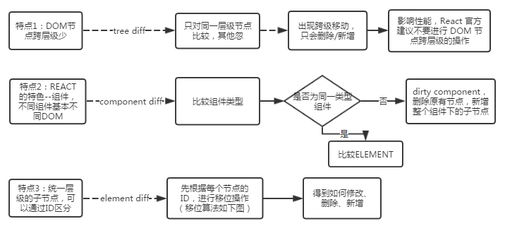


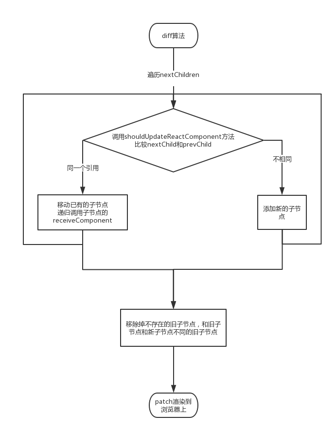

## 项目分析

### 分析需求

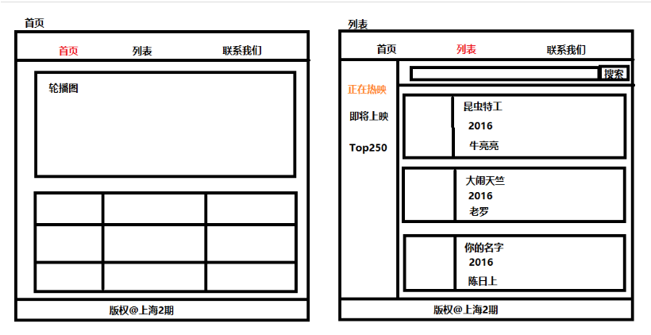

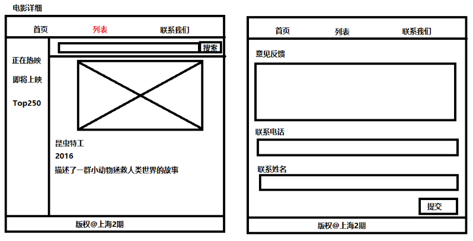

### 确定技术栈

> `webpack + react +react-router + fetch + sass + Flex + ES6`

## 路由

> 采用`react-router`： http://react-guide.github.io/react-router-cn/

### 路由基础实现

1. 安装`react-router`

		npm install react-router -save

2. 组件分离

		entry: {
		    app: path.resolve(__dirname, 'src/js/app.js'),
		    // 需要分离的第三方包名写在数组中
		    vendors: ['react', 'react-dom','react-router']
		}

3. 引入`Router`

		import React from 'react'
		import { Router, Route, Link ,hashHistory} from 'react-router'

4. 路由代码

		render() {
		    return (
		        <Router history={hashHistory}>
		            <Route path="/" component={AppContainer}>
		                <Route path="home" component={HomeContainer} />
		                <Route path="movie" component={MovieContainer}>
		                    <Route path="movieList" component={MovieListContainer} />
		                    <Route path="movieDetail" component={MovieDetailContainer} />
		                    <Route path="movieSearch" component={MovieSearchContainer} />
		                </Route>
		                <Route path="about" component={AboutContainer} />
		            </Route>
		        </Router>
		    );
		}

5.  组件代码

		render() {
		    return (
		        <div>
		            根容器组件
		            <div>
		                <Link to='/home'>首页</Link>
		                <Link to='/movie'>电影</Link>
		                <Link to='/about'>关于我们</Link>
		                <Link to='/movie/movieList'>电影列表</Link>
		                <Link to='/movie/movieDetail'>电影详细</Link>
		            </div>
		            <div>
		                {this.props.children}
		            </div>
		        </div>
		    );
		}

6. 设置默认页面

		<Route path="/" component={AppContainer}>
		    // 当URL为 / 时渲染 HomeContainer
		    <IndexRoute component={HomeContainer} />
		</Route>

### 绝对路由&路由重定向

> 解决路由层次嵌套过深问题

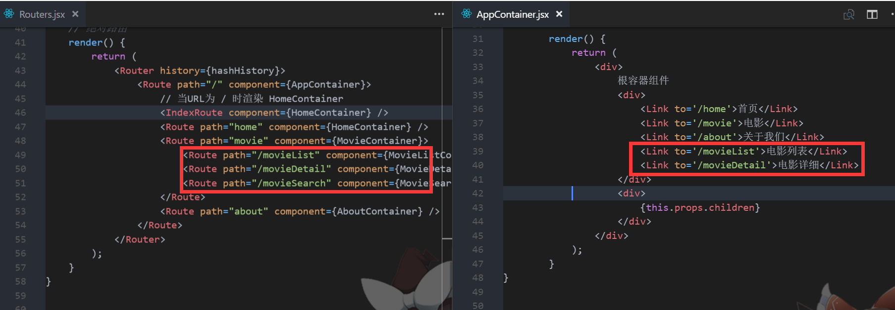

> 兼容旧路由-路由重定向

	// 兼容旧路由
	<Redirect from = 'movieList' to='/movieList'></Redirect>

### 进入/离开路由钩子

>  `onEnter` 和 `onLeave` 两个 `hook` ，在路由跳转过程中，`onLeave hook` 会在所有将离开的路由中触发，`onEnter hook` 会在所有进入的路由中触发。

	<Route path="home"
	    component={HomeContainer}
	    onEnter={()=>{console.log('进入了HomeContainer')}}
	    onLeave={()=>{console.log('离开了HomeContainer')}}
	/>

## 路径语法

> 路由路径是匹配一个（或一部分）URL 的 一个字符串模式。大部分的路由路径都可以直接按照字面量理解，除了以下几个特殊的符号：

> - `:paramName` 匹配一段位于 /、? 或 # 之后的 URL。 命中的部分将被作为一个参数
> - `()` 在它内部的内容被认为是可选的
> - `*` 匹配任意字符（非贪婪的）直到命中下一个字符或者整个 URL 的末尾，并创建一个 splat 参数

	<Route path="/hello/:name">         // 匹配 /hello/michael 和 /hello/ryan
	<Route path="/hello(/:name)">       // 匹配 /hello, /hello/michael 和 /hello/ryan
	<Route path="/files/*.*">           // 匹配 /files/hello.jpg 和 /files/path/to/hello.jpg

## 三种history

###  hashHistory

> 可以兼容低版本浏览器,路径后面带有`#`
> `http://localhost:8080/#/movieDetail`

###  browserHistory

> 使用最新 `HTML5` 的 `history API`,路由不带`#`
> `http://localhost:8080/movieDetail`

###  createMemoryHistory

> 在做服务端渲染时使用 `createMemoryHistory`

## 组件生命周期

> 组件跳转时的生命周期基本和组件生命周期一致，进入到一个组件，那么上一个组件被销毁，新的组件被渲染。如组件A->组件B:
> A: `componentWillUnmount` 销毁A组件
> B: `componentDidMount` 渲染B组件

## 组件外跳转

> 在`HTML`部分可以使用`Link`跳转，有时需要在JS内跳转，则需要使用`browserHistory`的`push`方法，或者`this.context.router`来实现

### browserHistory

	import { Router, browserHistory } from 'react-router'
	// 执行跳转
	browserHistory.push('/home')

### this.context.router

	// 获取router
	static contextTypes = {
	    router:React.PropTypes.object
	}
	
	// 组件渲染完毕的方法中进行跳转
	componentDidMount(){
	    this.context.router.push('/home')
	}

## 基本布局

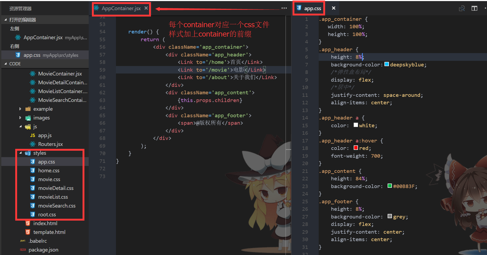

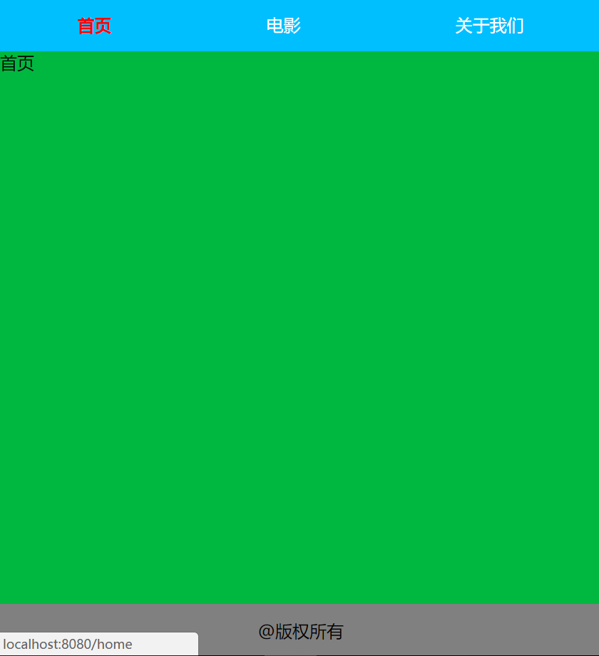

## Flex-box


> http://www.ruanyifeng.com/blog/2015/07/flex-grammar.html

## 电影页面布局

> `MovieContainer`

### JSX页面

	render() {
	    return (
	        <div className='movie_container'>
	            <div className='movie_menu'>
	                <a href="">正在热映</a>
	                <a href="">即将上映</a>
	                <a href="">TOP250</a>
	            </div>
	            <div className='movie_right'>
	                <div className='movie_search'>
	                    <input type="text"/>
	                    <button>搜索</button>
	                </div>
	                <div className='movie_content'>
	                    {this.props.children}
	                </div>
	            </div>
	        </div>
	    );
	}

### CSS样式

	.movie_container {
	    height: 100%;
	    display: flex;
	}
	.movie_menu {
	    width: 20%;
	    background-color: pink;
	    display: flex;
	    flex-direction: column;
	    justify-content: flex-start;
	    align-items: center;
	}
	.movie_menu a {
	    color: white;
	    padding-top: 1.5rem;
	}
	.movie_menu a:hover {
	    color: red;
	    font-weight: 700;
	}
	.movie_right {
	    width: 80%;
	    display: flex;
	    flex-direction: column;
	}
	.movie_search {
	    height: 2rem;
	    background-color:lightblue;
	    display: flex;
	    justify-content: center;
	    align-items: center;
	}
	.movie_search input {
	    width: 75%;
	    border-radius: 30px 0 0 30px;
	    text-indent: .5rem;
	}
	.movie_content {
	    flex: 1;
	    background-color: palegoldenrod;
	}


# 移动APP第四天

## 用户提示遮罩效果

> 关键: 用一个状态属性 `isLoading`控制渲染那个页面，改变`isLoading`就可以造成页面的重新渲染

	constructor(props) {
	    super(props);
	    this.state = {
	        isLoading:true
	    }
	}
	// render方法执行完毕 页面已经被加载
	componentDidMount(){
	    const _this = this;
	    setTimeout(function() {
	        _this.setState({
	            isLoading:false
	        })
	    }, 3000); 
	}
	renderLoading=()=>{
	    return (
	        <div>
	            正在加载数据....
	        </div>
	    )
	}
	renderMovieList=()=>{
	    return (
	        <div>
	            渲染电影列表
	        </div>
	    )
	}
	render() {
	    if(this.state.isLoading){
	        return this.renderLoading()
	    }else{
	        return this.renderMovieList()
	    }
	}

## fetch的使用

> Fetch API提供了一个fetch()方法，它被定义在BOM的window对象中，你可以用它来发起对远程资源的请求。 该方法返回的是一个ES6的Promise对象，让你能够对请求的返回结果进行检索。 它是 W3C 的正式标准。

### get请求

	// 本地json文件
	fetch("/data.json").then(function(res) {
	  // res instanceof Response == true.
	  if (res.ok) {
	    res.json().then(function(data) {
	      console.log(data.entries);
	    });
	  } else {
	    console.log("Looks like the response wasn't perfect, got status", res.status);
	  }
	}, function(e) {
	  console.log("Fetch failed!", e);
	});
	
	
	// 服务器数据
	fetch('http://nero-zou.com/test.json')  
	    .then((response) => {
	        if (response.ok) {
	            return response.json()
	        } else {
	            console.error('服务器繁忙，请稍后再试；\r\nCode:' + response.status)
	        }
	    })
	    .then((data) => {
	        console.log(data)
	    })
	    .catch((err)=> {
	        console.error(err)
	    })

### post请求

	fetch('/users', {
	  method: 'post',
	  headers: {
	    'Accept': 'application/json',
	    'Content-Type': 'application/json'
	  },
	  body: JSON.stringify({
	    name: 'Hubot',
	    login: 'hubot',
	  })
	})
	
	fetch("http://www.example.org/submit.php", {
	  method: "POST",
	  headers: {
	    "Content-Type": "application/x-www-form-urlencoded"
	  },
	  body: "firstName=Nikhil&favColor=blue&password=easytoguess"
	}).then(function(res) {
	  if (res.ok) {
	    alert("Perfect! Your settings are saved.");
	  } else if (res.status == 401) {
	    alert("Oops! You are not authorized.");
	  }
	}, function(e) {
	  alert("Error submitting form!");
	})

### 上传文件

	var input = document.querySelector('input[type="file"]')
	
	var data = new FormData()
	data.append('file', input.files[0])
	data.append('user', 'hubot')
	
	fetch('/avatars', {
	  method: 'post',
	  body: data
	})

## 搭建服务器

> 重新创建一个`douban_service`项目，安装`express`搭建服务器

### 基本搭建

> 安装`express`搭建服务器

	npm install express --save

> 安装`nodemon`自动重启服务器

	npm install nodemon -g

> 配置`index.js`

	const express = require('express')
	
	const app = express();
	
	app.get('/',function(req,res,next){
	    res.send('数据已经返回')
	})
	
	const server = app.listen('3008',function(){
	    console.log('服务器已启动,正在监听3008端口..')
	})

> 开启服务器

	nodemon index.js

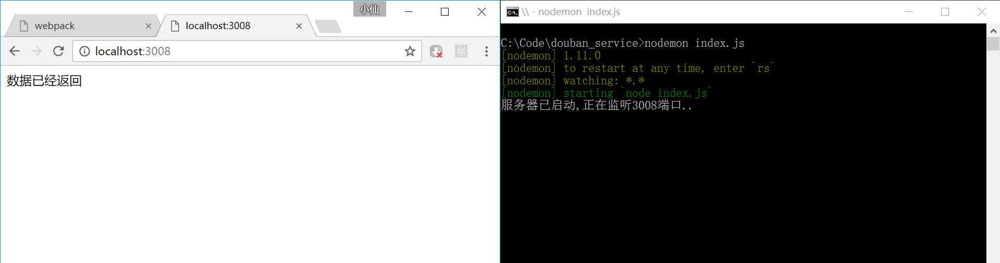


### 请求豆瓣API数据

> 豆瓣API : https://developers.douban.com/wiki/?title=guide
> 正在热映: https://api.douban.com/v2/movie/in_theaters?start=3&count=10
> 即将上映: https://api.douban.com/v2/movie/coming_soon?start=6&count=10
> TOP250: https://api.douban.com/v2/movie/top250?start=6&count=10
> 详细数据: https://api.douban.com/v2/movie/subject/1764796
> 搜索数据: https://api.douban.com/v2/movie/search?q={text}

#### 使用request请求第三方数据

> 安装`request`

	npm install request --save

> 引入`request`

	const request = require('request')

> 使用`request`发送请求

	app.get('/getMovieListData', function (req, res, next) {
	    const url = 'https://api.douban.com/v2/movie/in_theaters?start=3&count=10'
	
	    request(url, function (error, response, body) {
	        if(!error&&response.statusCode == 200){
	            res.json(body)
	        }
	    });
	})

### 数据接口配置文件

> 真实开发中会有测试服务器地址和线上服务器地址,所以一般接口信息写在单独的配置文件中

	export default {
	    SERVER_PATH:'127.0.0.1',
	    PORT:'3008',
	    HTTP:'http://',
	    VERSION:'1.0.0'
	}

### CORS解决跨域请求

> 客户端8080端口请求服务端3008端口，可以在服务端配置请求头使用CORS解决跨域

	// 实现cors跨域
	app.use(function (req,res,next) {
	    res.header("Access-Control-Allow-Origin", "*");
	    res.header("Access-Control-Allow-Headers", "Content-Type,Content-Length, Authorization, Accept,X-Requested-With");
	    res.header("Access-Control-Allow-Methods","PUT,POST,GET,DELETE,OPTIONS");
	    next()
	})

### 客户端请求数据

> 在APP中访问`movie`路由请求数据
> `MovieService`中使用`fetch`发起请求

	getMovieListData() {
	    // 拼接请求路径
	    const url = `${config.HTTP}${config.SERVER_PATH}${config.PORT}/getMovieListData`
	
	    fetch(url)
	        .then((response) => {
	            if (response.ok) {
	                return response.json()
	            } else {
	                console.error('服务器繁忙，请稍后再试；\r\nCode:' + response.status)
	            }
	        })
	        .then((data) => {
	            console.log(data)
	        })
	        .catch((err) => {
	            console.error(err)
	        })
	}
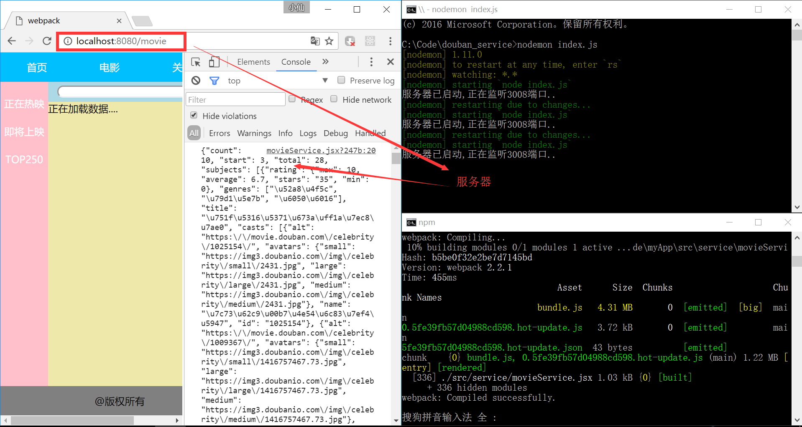


## 渲染电影列表

### Promise处理返回数据

> promise实例对象通用代码

	var promise = new Promise(function(resolve, reject) {
	  // ... some code
	  if (/* 异步操作成功 */){
	    resolve(value);
	  } else {
	    reject(error);
	  }
	});

#### 返回promise对象

	return new Promise(function(resove,reject){
	    fetch(url)
	    .then((response) => {
	        if (response.ok) {
	            return response.json()
	        } else {
	            console.error('服务器繁忙，请稍后再试；\r\nCode:' + response.status)
	        }
	    })
	    .then((data) => {
	        // 请求成功调用resove
	        resove(data)
	        // console.log(data)
	    })
	    .catch((err) => {
	        // 请求失败调用reject
	        reject(err)
	        // console.error(err)
	    })
	})

#### 接收promise对象数据

	fetch=()=>{
		   // 接收promise对象数据
		   const promise = service.getMovieListData()
		   // 处理数据
		   promise.then(
		       function(data){
		           console.log(data)
		       },
		       function(err){
		           console.log(err)
		       }
		   ).catch(function(err){
		       console.log(err)
		   })
	}

### 渲染页面

1. 改变`state`，去掉遮罩，存储数据

	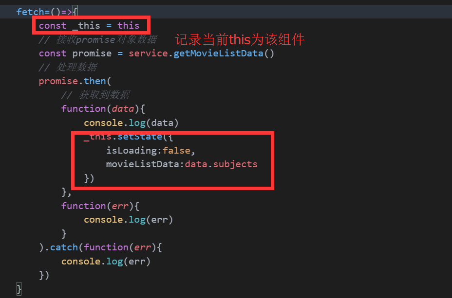

2. `render`中渲染页面

		// 渲染电影列表
		renderMovieList = ()=> {
		    return (
		        <div>
		            {this.state.movieListData.map(this.renderItem)}
		        </div>
		    )
		}
		
		// 渲染每一行数据
		renderItem = (item)=>{
		    return (
			    // 循环渲染子组件指定KEY
		        <div key={item.id}>
		            
		            <div>
		                <h1>{item.title}</h1>
		                <span>{item.year}</span>
		            </div>
		        </div>
		    )
		};
		
3. 添加样式

	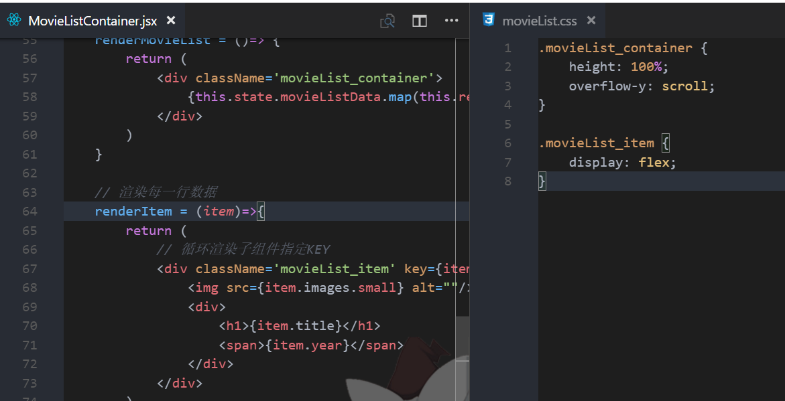

## 详细页面

### 跳转详细页面

	// 获取router
	static contextTypes = {
	    router:React.PropTypes.object
	}
	
	// 跳转到详细页面
	goDetail=(id)=>{
	    this.context.router.push(`/movie/movieDetail/${id}`)
	}
	
	// 绑定点击事件
	// 循环渲染子组件指定KEY
	<div className='movieList_item' key={item.id} onClick={()=>this.goDetail(item.id)}>
	    
	    <div>
	        <h1>{item.title}</h1>
	        <span>{item.year}</span>
	    </div>
	</div>

### 遮罩及初始化数据

	this.state = {
	    isLoading: true,
	    movieDetailData: {}
	}
		
	render() {
	        if (this.state.isLoading) {
	            return this.renderLoading()
	        } else {
	            return this.renderMovieDetail()
	        }
	}

### 请求详细页面数据

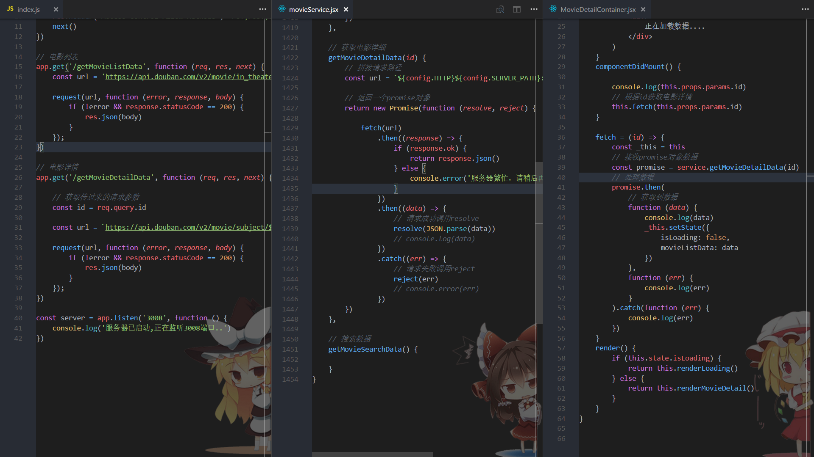

### 渲染页面

> HTML

	renderMovieDetail = () => {
	    return (
	        <div className='movieDetail_container'>
	            <div className='movieDetail_image'>
	                
	            </div>
	            <h1>{this.state.movieDetailData.title}</h1>
	            <p>{this.state.movieDetailData.summary}</p>
	        </div>
	    )
	}

> CSS

	.movieDetail_container {
	    height: 100%;
	    overflow-y: scroll;
	}
	
	.movieDetail_image {
	    display: flex;
	    justify-content: center;
	    align-items: center;
	}

## 加载更多

### 监听滚动事件

	// 组件更新函数
	componentDidUpdate(){
	    this.addEventListener()
	}
	
	// 添加监听滚动事件
	addEventListener=()=>{
	    // 获取真实DOM节点
	    this.refs.scrollContainer.addEventListener('scroll',function(e){
	        console.log(e)
	    })
	}
	// 真实DOM上使用ref添加标记
	// 渲染电影列表
	renderMovieList = ()=> {
	    return (
	        <div ref='scrollContainer' className='movieList_container'>
	            {this.state.movieListData.map(this.renderItem)}
	        </div>
	    )
	}

### 判断滚动到底部

	if (e.target.scrollHeight == e.target.offsetHeight +parseInt(e.target.scrollTop)) {
	    console.log('滚动到底部了')
	    // 重新请求数据
	    _this.fetch();
	}

### 重新加载数据

> 重新加载数据需要重新发送请求，在赋值数据时需要判断原数组是否有数据，如果有则进行拼接数据

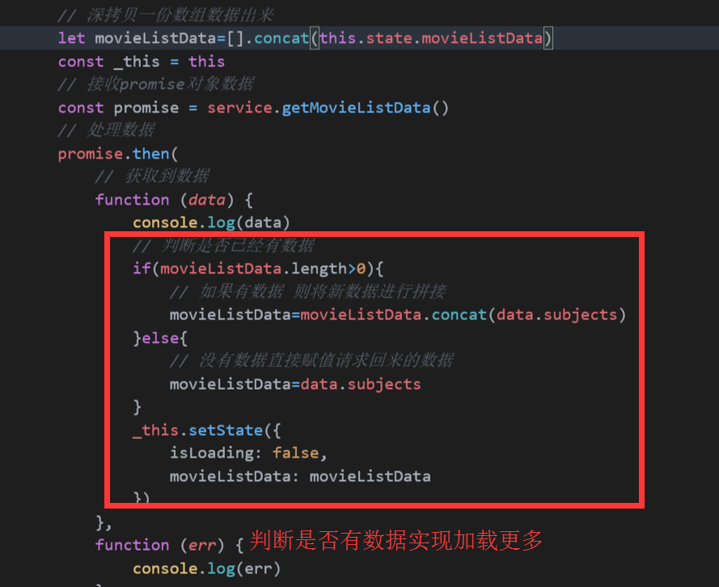

## 分页功能

### 服务器代码

	// 电影列表
	app.get('/getMovieListData', function (req, res, next) {
	
	    // 获取传递的请求参数信息
	    const message = JSON.parse(req.query.message);
	    console.log(message)
	
	    const url = `https://api.douban.com/v2/movie/${message.movieType}?start=${message.start}&count=${message.count}`
	
	    console.log(url)
	    request(url, function (error, response, body) {
	        if (!error && response.statusCode == 200) {
	            res.json(body)
	        }
	    });
	})

### 后台接口代码

	// 获取电影列表
	getMovieListData(message) {
	    // 拼接请求路径
	    const url = `${config.HTTP}${config.SERVER_PATH}:${config.PORT}/getMovieListData?message=${message}`
	
	    console.log(url)
	    // 返回一个promise对象
	    return new Promise(function (resolve, reject) {
	        fetch(url)
	            .then((response) => {
	                if (response.ok) {
	                    return response.json()
	                } else {
	                    console.error('服务器繁忙，请稍后再试；\r\nCode:' + response.status)
	                }
	            })
	            .then((data) => {
	                // 请求成功调用resolve
	                resolve(JSON.parse(data))
	                // console.log(data)
	            })
	            .catch((err) => {
	                // 请求失败调用reject
	                reject(err)
	                // console.error(err)
	            })
	    })
	}

### 组件代码

	// 请求电影列表数据
	fetch = (movieType) => {
	
	    // 深拷贝一份数组数据出来
	    let movieListData = [].concat(this.state.movieListData)
	
	    // 深拷贝一个对象
	    let message = Object.assign({}, this.state.message)
	    // 每次发送请求时改变请求参数
	    message.movieType = movieType
	    message.start = (message.pageIndex - 1) * message.count
	    message.pageIndex++
	
	    const _this = this
	    // 接收promise对象数据
	    const promise = service.getMovieListData(JSON.stringify(message))
	    // 处理数据
	    promise.then(
	        // 获取到数据
	        function (data) {
	            console.log(data)
	            // 判断是否已经有数据
	            if (movieListData.length > 0) {
	                // 如果有数据 则将新数据进行拼接
	                movieListData = movieListData.concat(data.subjects)
	            } else {
	                // 没有数据直接赋值请求回来的数据
	                movieListData = data.subjects
	            }
	            _this.setState({
	                isLoading: false,
	                movieListData: movieListData,
	                message:message
	            })
	        },
	        function (err) {
	            console.log(err)
	        }
	    ).catch(function (err) {
	        console.log(err)
	    })
	}

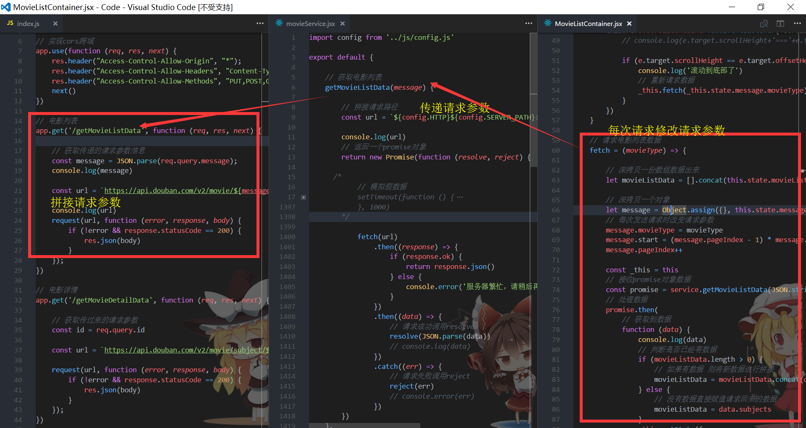


### 分页功能完善

> 防止触发多次请求

	// // 防止多次触发请求
	if (_this.state.isBottom) {
	    return;
	}
	// 标记已经滚动到底部
	_this.setState({
	    isBottom: true
	})
	// 重新请求数据
	_this.fetch(_this.state.message.movieType);

> 显示提示信息

	// 渲染电影列表
	renderMovieList = () => {
	    return (
	        <div ref='scrollContainer' className='movieList_container'>
	            {this.state.movieListData.map(this.renderItem)}
	            <div className={this.state.isBottom?"movieList_show":"movieList_hide"}>
	                <span>正在请求数据,请稍等...</span>
	            </div>
	        </div>
	    )
	}

	CSS:
	
	.movieList_show{
	    background-color: palevioletred;
	    display: flex;
	    justify-content: center;
	    align-items: center;
	}
	
	.movieList_hide{
	    display: none;
	}

# 移动APP第五天

## 电影类别切换

### 传递类别信息

> `MovieContainer`

	<div className='movie_menu'>
	    <Link to="/movie/movieList/in_theaters">正在热映</Link>
	    <Link to="/movie/movieList/coming_soon">即将上映</Link>
	    <Link to="movie/movieList/top250">TOP250</Link>
	</div>
	
> `Routers`

	<Route path="movieList/:movieType" component={MovieListContainer} />

> `MovieListContainer`

	// 生命周期函数：接收到参数时调用
	componentWillReceiveProps(nextProps){
	    // console.log(nextProps)
	    // 传递电影类别
	    this.fetch(nextProps.params.movieType)
	}

### 切换类别重置请求信息

	if (movieType != this.state.message.movieType) {
	    this.setState({
	        isLoading: true,
	        movieListData: [],
	        // 是否滚动到底部
	        isBottom: false,
	        // 请求参数
	        message: {
	            // 电影数据类型
	            movieType: movieType,
	            pageIndex: 1,
	            start: 0,
	            count: 10
	        }
	    })
	    return;
	}

### 根据loading状态触发请求

	// 组件更新函数
	componentDidUpdate() {
	    if(this.state.isLoading){
	        this.fetch(this.state.message.movieType)
	    }else{
	        this.addEventListener()
	    }
	}

### 解决切换类别时scroll触发请求

> 在`loading`状态注销滚动事件

	componentDidUpdate() {
	    if(this.state.isLoading){
	        // 防止切换类别时scroll在底部自动触发请求
	        this.refs.scrollContainer.onscroll = null;
	        this.fetch(this.state.message.movieType)
	    }else{
	        this.addEventListener()
	    }
	}

> `loading` 添加样式

	<div ref='scrollContainer' className='movieList_container'>
	    正在加载数据....
	</div>

### 记录选中类别

> 添加点击事件

	<div className='movie_menu'>
	    <Link className={this.state.movieType == 'in_theaters'?'movie_current':''} to="/movie/movieList/in_theaters" onClick={() => this.changeMovieType('in_theaters')}>正在热映</Link>
	    <Link className={this.state.movieType == 'coming_soon'?'movie_current':''} to="/movie/movieList/coming_soon" onClick={() => this.changeMovieType('coming_soon')}>即将上映</Link>
	    <Link className={this.state.movieType == 'top250'?'movie_current':''} to="movie/movieList/top250" onClick={() => this.changeMovieType('top250')}>TOP250</Link>
	</div>

> 根据点击事件传递的类别改变记录的类别信息

	// 根据点击事件改变类别信息
	changeMovieType = (movieType) => {
	    this.setState({
	        movieType:movieType
	    })
	}

> 根据类别更改样式

	className={this.state.movieType == 'in_theaters'?'movie_current':''}

## 搜索功能

### 受控表单

	<input type="text" value={this.state.keyword} onChange={this.changeKeyWord}/>
	
	// 根据输入的文字改变记录的信息 然后更改表单中的显示
	changeKeyWord = (e)=>{
	    this.setState({
	        keyword:e.targe.value
	    })
	}

### 跳转页面

	// 1. 添加点击事件
	<button onClick={this.goSearch}>搜索</button>
	
	// 2. 页面跳转
	goSearch = () => {  
	// 使用router的push方法跳转页面    this.context.router.push(`/movie/movieSearch/${this.state.keyword}`)
	    // 清空关键字
	    this.setState({
	        keyword: '',
	        movieType: ''
	    })
	}
	
	// 3.接收参数
	// 路由
	<Route path="movieSearch/:keyword" component={MovieSearchContainer} />
	// MovieSearchContainer
	console.log(this.props.params.keyword)

### 请求数据

> `MovieSearchContainer` 中逻辑和`MovieListContainer`中一样,只需要把`movieType`全部改成`keyword`

## 服务器渲染

### 发布代码

> 使用`npm run publish` 发布代码，将代码放到服务器上,配置服务器使用服务器渲染页面

	// 修改webpack.publish.config
	output: {
	    // 输出至哪个文件夹
	    path: path.resolve(__dirname, 'dist'),
	    // 输出的文件名
	    filename: 'bundle.js',
	    publicPath: '/',
	    sourceMapFilename:'[name].map'
	}

### 配置服务器

> 将发布后的代码拷贝到服务器下的`public`文件夹，然后服务器添加如下信息

	app.use(express.static(__dirname+'/public'))
	
	app.get('*',function(req,res,next){
	    res.sendFile(path.resolve(__dirname,'public','index.html'))
	})

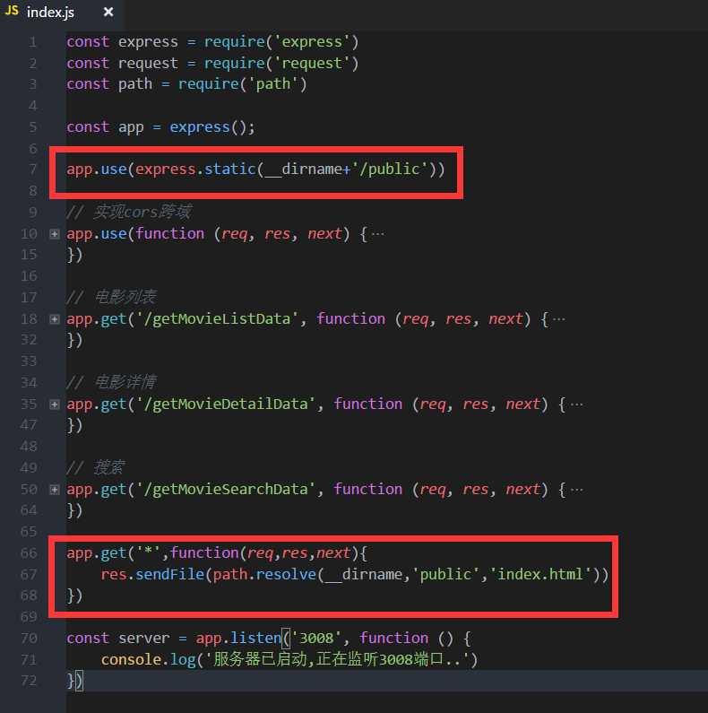

> 此时就可以用服务器地址访问项目

## 异步代码加载

> 凡是非首页都需要用到该页面时再加载js代码

### 更改路由配置

1. 取消代码引入

	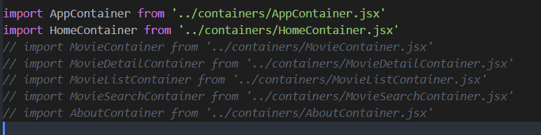

2. 异步加载代码

		<Route path="movie"
		    getComponent={
		        (nextState, callback) => {
		            require.ensure([], (require) => {
		                callback(null, require("../containers/MovieContainer.js").default)
		            }, "movie")
		        }
		    }
		>
		
### 修改发布配置

> 添加`chunkFilename`

	output: {
	    // 输出至哪个文件夹
	    path: path.resolve(__dirname, 'dist'),
	    // 输出的文件名
	    filename: 'bundle.js',
	    publicPath: '/',
	    chunkFilename: '[name]_[chunkhash:8]_chunk.jsx',
	    sourceMapFilename: '[name].map'
	}
	
> 重新发布代码

	npm run publish

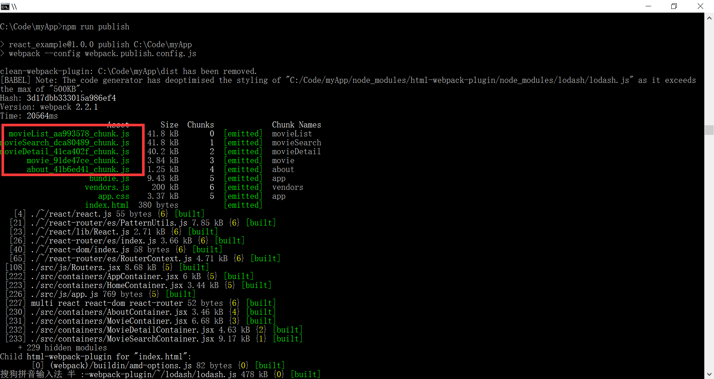

# webpack2学习

## 介绍
* webpack和gulp一样是一个自动化的构建工具
  + 你不想做的东西都交给工具去做，比如混淆，压缩，移动，合并，添加浏览器兼容性词缀
* gulp更适合做简单的流程性的操作，webpack是专门为处理SPA应用的复杂文件依赖而出现的
  * 如图

  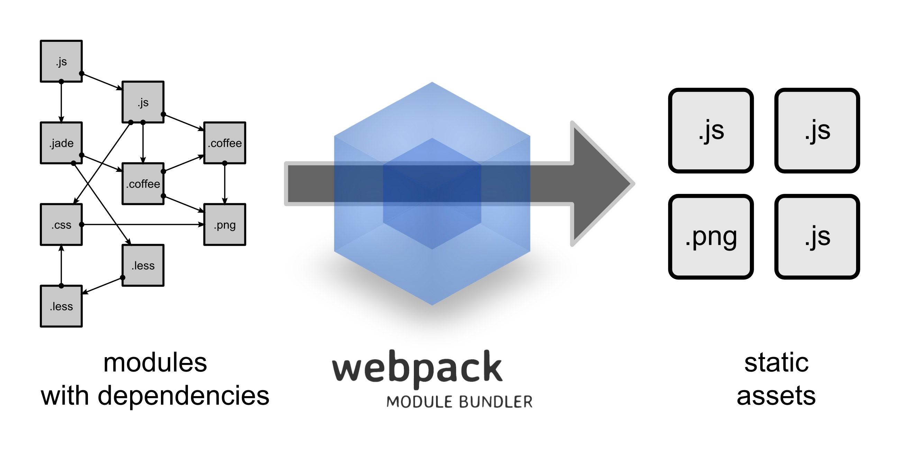


### 安装依赖
* `npm install webpack -g`
* `npm install webpack -save-dev`

### 编写配置文件

	var path=require('path')
	
	module.exports = {
	    // 指定spa应用的入口文件
	    entry: path.resolve(__dirname, 'src/js/app.js'),
	    // 指定项目构建的输出位置
	    output: {
	        path: path.resolve(__dirname, 'dist'),
	        filename: 'bundle.js',
	    }
	}

### 运行
* 在项目根目录执行`webpack`可以启动默认配置文件webpack.config.js
* 运行指定配置文件执行`webpack --config webpack.develop.config.js`

### 把运行命令放到package.json文件中
* 启动命令还可以加很多参数`webpack --config webpack.develop.config.js --progress --profile --colors`
* 这么多参数不可能都记住，所以将启动命令写到package.json的script标签中

### 监听代码变化自动重新构建
* 代码的变动需要多次运行`npm run develop`所以我们需要自动监听代码变动，然后运行构建，于是我们用到了webpack-dev-server这个模块

#### webpack-deve-server介绍
* webpack-dev-server封装了webpack和http模块
  + 所以webpack的所有命令，webpack-deve-server都可以使用
  + webpack-dev-server可以指定一个文件夹启动一个服务
    - webpack-dev-server启动的服务所有的内容都构建在内存中
    - 因为构建在内存中速度快，还有一个功能，就是没有变化的文件，不重新构建，只有变化了的文件才从新执行构建
* 作用
  + 一是监听文件变化自动重新构建
  + 二是自动刷新浏览器，可以热更新

#### 基本使用
*  下载`npm install webpack-dev-server@9.9.9 -save-dev`,注意选择2.x版本的模块
*  修改package.json文件中的命令`webpack-dev-server --config webpack.develop.config.js --progress --profile --colors`
*  修改开发配置文件
   + webpack2中推荐所有的服务配置信息都写到配置文件中的devServer属性中，不要写在package.json中
   + 基本配置

   ```
   devServer: {
        // 指定启动服务的更目录
        contentBase: __dirname + '/src',
        // 指定端口号
        port: 8080,
        host: 'localhost',
        // 以下信息可有可无，为了完整
        inline: true, 
        historyApiFallback: true,
        noInfo: false,
        // stats: 'minimal',
        // publicPath: publicPath
   },
   ```

#### 热更新
* 可以不刷新浏览器更新
* 修改配置文件

```
devServer: {
    // 指定启动服务的更目录
    contentBase: __dirname + '/src',
    // 指定端口号
    port: 8080,
    host: 'localhost',
    // 启用热更新
    hot: true,
    // 以下信息可有可无，为了完整
    inline: true, 
    historyApiFallback: true,
    noInfo: false,
    // stats: 'minimal',
    // publicPath: publicPath
},
```

* 需要配合一个内置插件一起使用

```
var webpack=require('webpack')

plugins: [
   new webpack.HotModuleReplacementPlugin(),
]
```

## Loaders（加载器）
* 在真正构建之前做一些预处理操作就叫加载器

### 处理es6、es7、jsx语法加载器
* `npm install babel-loader --save-dev`
* `npm install babel-core  babel-preset-es2015   babel-preset-react -save-dev`
* `npm install babel-preset-stage-0 babel-preset-stage-1 babel-preset-stage-2 babel-preset-stage-3 --save-dev`
* `npm install babel-plugin-transform-runtime -save-dev`这个插件的作用是支持es7特性
* 修改配置文件

```
module: {
        rules: [
            {
                test: /\.jsx?$/,
                exclude: /node_modules/,
                use: [
                    {
                        loader: "babel-loader"
                    }
                ]
            }
        ]
    }
```

* 创建.babelrc文件

```
{
  "presets": [
    "es2015",
    "react",
    "stage-0",
    "stage-1",
    "stage-2",
    "stage-3"
  ],
  "plugins": [
    "transform-runtime"
  ]
}
```

### 处理css文件引用的加载器
* `npm install style-loader css-loader -save-dev`
* 修改配置文件

```
 // 处理在js中引用css文件
{
    test: /\.css$/,
    use: ['style-loader', 'css-loader'],
},
```

### 处理scss或者less文件引用的加载器
* `npm install sass-loader less-loader node-sass -save-dev`
* 修改配置文件

```
  // 处理在js中引用scss文件
{
    test: /\.scss$/,
    use: ['style-loader', 'css-loader', 'sass-loader'],
},
{
    test: /\.less$/,
    use: ['style-loader', 'css-loader', 'less-loader'],
},
```

### 处理图片引用的加载器
* `npm install url-loader file-loader -save-dev`
* 修改配置文件

```
// 处理图片操作  25000bit ~3kb
{
    test: /\.(png|jpg|jpeg|gif)$/,
    use: 'url-loader'
},
```

### 处理字体文件引用的加载器
* `npm install url-loader file-loader -save-dev`
* 修改配置文件

```
// 处理字体文件
{
    test: /\.(eot|woff|ttf|woff2|svg)$/,
    use: 'url-loader'
}
```
## 发布策略
* 简单的说就是将开发阶段的配置文件复制一份到部署的配置文件中，然后删删改改就可以了
* 把热更新插件删除，devServer属性删除
* 修改图片处理和字体处理加载器

```
 // 处理图片操作  25000bit ~3kb
{
    test: /\.(png|jpg|jpeg|gif)$/,
    use: 'url-loader?limit=25000&name=images/[name].[ext]'
},
// 处理字体文件
{
    test: /\.(eot|woff|ttf|woff2|svg)$/,
    use: 'url-loader?limit=100000&name=fonts/[name].[ext]'
}
```

* 接下来运行`npm run  publish`就发布了
* 不过要注意所有的css，js，图片都构建到一个bundle.js文件中了


## Plugins（插件）
* 在真正构建之后做一些后处理操作就叫插件

### 删除插件
* `npm install clean-webpack-plugin -save-dev`
* 使用

```
var CleanPlugin = require('clean-webpack-plugin');

plugins: [
    // 删除文件夹的插件
    new CleanPlugin(['dist'])
]
```

### 抽取公共js插件
* 使用

```
 entry: {
        app: path.resolve(__dirname, 'src/js/app.js'),
        vendors: ['vue','vue-router','vuex']
    },
    
    
plugins: [
    // 分离第三方应用的插件
    new webpack.optimize.CommonsChunkPlugin({name: 'vendors', filename: 'vendors.js'}),
]
```

### 提取样式文件插件
* `npm install extract-text-webpack-plugin@4.4.4 -save-dev`注意下载2.x版本
* 使用

```
// 1、抽取css的第三方插件
var ExtractTextPlugin = require("extract-text-webpack-plugin");

// 2、处理在js中引用css文件
{
    test: /\.css$/,
    use: ExtractTextPlugin.extract({
        fallbackLoader: "style-loader",
        loader: "css-loader"
    })
},
// 处理在js中引用scss文件
{
    test: /\.scss$/,
    use: ExtractTextPlugin.extract({
        fallbackLoader: "style-loader",
        loader: "css-loader!sass-loader"
    })
},

//3、加一个插件
plugins: [
    // 删除文件夹的插件
    new ExtractTextPlugin("app.css"),
]

```


### 自动生成html插件
* `npm install html-webpack-plugin -save-dev`
* 在根目录创建template.html

```
<!DOCTYPE html>
<html lang="en">
<head>
    <meta charset="UTF-8">
    <meta name="viewport"
          content="width=device-width, user-scalable=no, initial-scale=1.0, maximum-scale=1.0, minimum-scale=1.0">
    <title>webpack学习</title>
</head>
<body>
<div id="app"></div>
</body>
</html>
```

* 修改配置文件

```
var HtmlWebpackPlugin = require('html-webpack-plugin');

plugins: [
    // 自动生成html插件
   new HtmlWebpackPlugin({
       template: './src/template.html',
       htmlWebpackPlugin: {
           "files": {
               "css":["app.css"],
               "js": ["vendors.js", "bundle.js"]
           }
       },
       minify: {
           removeComments: true,
           collapseWhitespace: true,
           removeAttributeQuotes: true
       }
   }),
]
```

### 压缩插件
* 修改配置文件

```
plugins: [
   // 压缩混淆js代码插件
   new webpack.optimize.UglifyJsPlugin({
       beautify: false,
       mangle: {
           screw_ie8: true,
           keep_fnames: true
       },
       compress: {
           warnings: false,
           screw_ie8: true
       },
       comments: false
   }),
]

```


### 定义生产环境插件
* 修改配置文件

```
plugins: [
  // 在构建的过程中删除警告
   new webpack.DefinePlugin({
       'process.env':{
           NODE_ENV:'"production"'
       }
   })
]
```


### 自动打开浏览器插件
* `npm install open-browser-webpack-plugin -save-dev`
* 使用

```
// 自动打开浏览器插件
var OpenBrowserPlugin = require('open-browser-webpack-plugin')

plugins: [
    // 删除文件夹的插件
   new OpenBrowserPlugin({url: 'http://localhost:8080/', browser: 'chrome'})
]
```


## 高级
### 和gulp的集成
* `npm install gulp del gulp-sequence -save-dev`
* 编写配置文件

```
// gulp的任务是控制执行流程，webpack的任务是处理复杂引用的依赖

var gulp = require('gulp');
// 删除文件和目录
var del = require('del');
// 按顺序执行
var gulpSequence = require('gulp-sequence');
// 引入webpack的本地模块
var webpack = require("webpack");
// 引入wbpack的配置文件
var webpackConfig = require("./webpack.publish.config.js");

gulp.task('default', ['sequence'], function () {
    console.log("项目构建成功");
});

// 流程控制
gulp.task('sequence', gulpSequence('clean','webpack'));

// 删除文件和文件夹
gulp.task('clean', function (cb) {
    //del('dist);// 如果直接给dist的目录，项目启动的顺序还有清除结果会报错，所以要写的更详细一些
    del(['dist/*.js', 'dist/*.css', 'dist/images', 'dist/fonts,','dist/*.html']).then(function () {
        cb()
    });
});


//写一个任务，在gulp中执行webpack的构建
// gulp 负责任务流程部分的操作，webpack负责复杂模块系统的引用分离工作
gulp.task('webpack', function (cb) {
    // 执行webpack的构建任务
    webpack(webpackConfig, function (err, stats) {

        if (err) {
            console.log("构建任务失败");
        } else {
            cb();
        }

    });
});
```

<!--
	Author:LEO
	WeChat:zw142857
	QQ:765508285
-->


